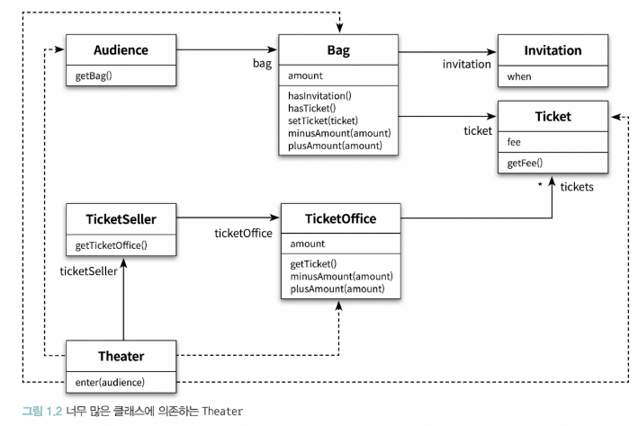
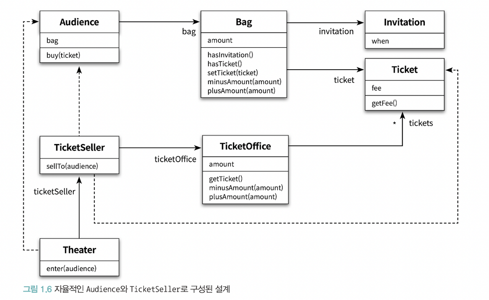

# 1장. 객체, 설계
<!-- TOC -->

- [장. 객체, 설계](#%EC%9E%A5-%EA%B0%9D%EC%B2%B4-%EC%84%A4%EA%B3%84)
- [🔷 티켓 판매 애플리케이션 설계](#-%ED%8B%B0%EC%BC%93-%ED%8C%90%EB%A7%A4-%EC%95%A0%ED%94%8C%EB%A6%AC%EC%BC%80%EC%9D%B4%EC%85%98-%EC%84%A4%EA%B3%84)
        - [🔻 요구사항](#-%EC%9A%94%EA%B5%AC%EC%82%AC%ED%95%AD)
- [🔷 절차 지향적인 설계](#-%EC%A0%88%EC%B0%A8-%EC%A7%80%ED%96%A5%EC%A0%81%EC%9D%B8-%EC%84%A4%EA%B3%84)
    - [🔸 소프트웨어 모듈이 가져야 하는 3가지 기능](#-%EC%86%8C%ED%94%84%ED%8A%B8%EC%9B%A8%EC%96%B4-%EB%AA%A8%EB%93%88%EC%9D%B4-%EA%B0%80%EC%A0%B8%EC%95%BC-%ED%95%98%EB%8A%94-3%EA%B0%80%EC%A7%80-%EA%B8%B0%EB%8A%A5)
        - [🔻 위 코드의 문제](#-%EC%9C%84-%EC%BD%94%EB%93%9C%EC%9D%98-%EB%AC%B8%EC%A0%9C)
        - [🔻 목표](#-%EB%AA%A9%ED%91%9C)
- [🔷 설계 개선하기](#-%EC%84%A4%EA%B3%84-%EA%B0%9C%EC%84%A0%ED%95%98%EA%B8%B0)
    - [🔸 자율성을 높이자](#-%EC%9E%90%EC%9C%A8%EC%84%B1%EC%9D%84-%EB%86%92%EC%9D%B4%EC%9E%90)
        - [🔻 캡슐화와 인터페이스](#-%EC%BA%A1%EC%8A%90%ED%99%94%EC%99%80-%EC%9D%B8%ED%84%B0%ED%8E%98%EC%9D%B4%EC%8A%A4)
        - [🔻 결과](#-%EA%B2%B0%EA%B3%BC)
- [🔷 절차지향 vs 객체지향](#-%EC%A0%88%EC%B0%A8%EC%A7%80%ED%96%A5-vs-%EA%B0%9D%EC%B2%B4%EC%A7%80%ED%96%A5)
        - [🔻 절차지향](#-%EC%A0%88%EC%B0%A8%EC%A7%80%ED%96%A5)
        - [🔻 객체지향](#-%EA%B0%9D%EC%B2%B4%EC%A7%80%ED%96%A5)
        - [❓ 의문](#-%EC%9D%98%EB%AC%B8)
    - [🔸 두 방식의 차이](#-%EB%91%90-%EB%B0%A9%EC%8B%9D%EC%9D%98-%EC%B0%A8%EC%9D%B4)
        - [🔻 책임의 이동 shift of responsibility](#-%EC%B1%85%EC%9E%84%EC%9D%98-%EC%9D%B4%EB%8F%99-shift-of-responsibility)
        - [🔻 의인화](#-%EC%9D%98%EC%9D%B8%ED%99%94)
- [🔷 객체 지향적인 설계](#-%EA%B0%9D%EC%B2%B4-%EC%A7%80%ED%96%A5%EC%A0%81%EC%9D%B8-%EC%84%A4%EA%B3%84)
    - [🔸 설계가 왜 필요한가](#-%EC%84%A4%EA%B3%84%EA%B0%80-%EC%99%9C-%ED%95%84%EC%9A%94%ED%95%9C%EA%B0%80)
    - [🔸 설계의 tradeoff](#-%EC%84%A4%EA%B3%84%EC%9D%98-tradeoff)

<!-- /TOC -->


# 🔷 티켓 판매 애플리케이션 설계
### 🔻 요구사항
1) Invitation, Ticket, Bag, Audience
- 이벤트에 당첨된 관람객은 초대장을 티켓으로 교환한 후 입장한다
- 이벤트에 당첨되지 않은 관람객은 티켓을 구매해야만 입장할 수 있다

2) TicketOffice, TicketSeller, Theater
- 티켓을 관리하고 판매하는 역할 진행

&nbsp;

# 🔷 절차 지향적인 설계


```java
public class Theater {
    private TicketSeller ticketSeller;

    public Theater(TicketSeller ticketSeller) {
        this.ticketSeller = ticketSeller;
    }

    public void enter(Audience audience){
        if(audience.getBag().hasInvitation()){
            Ticket ticket = ticketSeller.getTicketOffice().getTicket();
            audience.getBag().setTicket(ticket);
        }else{
            Ticket ticket = ticketSeller.getTicketOffice().getTicket();
            audience.getBag().minusAmount(ticket.getFee());
            ticketSeller.getTicketOffice().plusAmount(ticket.getFee());
            audience.getBag().setTicket(ticket);
        }
    }
}
```

## 🔸 소프트웨어 모듈이 가져야 하는 3가지 기능
- 모듈은 정상적으로 실행되어야 한다
- 변경이 용이해야 한다
- 이해하기 쉬워야 한다

### 🔻 위 코드의 문제
1) 예상을 빗나가는 코드
- 소극장이 관람객의 가방에서 직접 돈을 가져간다 (관람객의 허락 x)
- 소극장이 직접 매표소의 티켓과 현금에 접근한 후, 관람객에게 티켓을 전달한다
- 따라서 티켓 판매원이 하는 일이 없다

2) 변경에 취약한 코드
- Audience와 TicketSeller를 변경할 경우 Theater도 함께 변경해야 한다
- 객체 사이의 **의존성**이 과하기 때문이다 (의존성: 어떤 객체가 변경될 때, 그 객체에게 의존하는 다른 객체도 함께 변경될 수 있다)
- 이렇게 의존성이 과한 경우를 **결합도coupling**이 높다고 한다

### 🔻 목표
- 애플리케이션의 기능을 유지하는 데 필요한 최소한의 의존성만 유지하고 불필요한 의존성을 제거하는 것이다

&nbsp;

# 🔷 설계 개선하기
## 🔸 자율성을 높이자
> Audience와 TicketSeller를 자율적인 존재로 만들자

- 설계를 변경하기 어려운 이유는 Theater가 아래에 접근하기 때문이다
   - Audience 및 TicketSeller에 접근
   - Audience 소유의 Bag에 접근
   - TicketSeller가 근무하는 TicketOffice까지 접근

```java
// Theater의 enter 메서드에서 TicketOffice에 접근하는 모든 코드를 TicketSeller에게로 옮기자
public class Theater {
    private TicketSeller ticketSeller;

    public Theater(TicketSeller ticketSeller) {
        this.ticketSeller = ticketSeller;
    }

    public void enter(Audience audience){
        if(audience.getBag().hasInvitation()){
            Ticket ticket = ticketSeller.getTicketOffice().getTicket();
            audience.getBag().setTicket(ticket);
        }else{
            Ticket ticket = ticketSeller.getTicketOffice().getTicket();
            audience.getBag().minusAmount(ticket.getFee());
            ticketSeller.getTicketOffice().plusAmount(ticket.getFee());
            audience.getBag().setTicket(ticket);
        }
    }
}
```

```java
public class Theater {
    private TicketSeller ticketSeller;

    public Theater(TicketSeller ticketSeller) {
        this.ticketSeller = ticketSeller;
    }

    public void enter(Audience audience){
        ticketSeller.sellTo(audience);
    }
}
```

### 🔻 캡슐화와 인터페이스
- TicketOffice에 대한 접근은 오직 TicketSeller에서만 가능하다
- 캡슐화: 개념적이나 물리적으로 객체 내부의 세부적인 사항을 감추는 것
- 객체를 인터페이스와 구현으로 나누고 인터페이스만을 공개하는 것은, 객체 사이의 결합도를 낮추고 변경하기 쉬운 코드를 작성하기 위한 기본 원칙이다
   - Theater는 오직 TicketSeller의 인터페이스에만 의존한다
   - TicketSeller가 내부에 TickerOffice 인스턴스를 포함하고 있다는 사실은 구현의 영역에 속한다

```java
// TicketSeller의 getBag 메서드를 Audience 안으로 옮겨주자!
public class Audience {
    private Bag bag;

    public Audience(Bag bag) {
        this.bag = bag;
    }

    public Long buy(Ticket ticket){
        if(bag.hasInvitation()){
            bag.setTicket(ticket);
            return 0L;
        }else{
            bag.setTicket(ticket);
            bag.minusAmount(ticket.getFee());
            return ticket.getFee();
        }
    }
}
```

### 🔻 결과


**핵심은 객체 내부의 상태를 캡슐화하고, 객체 간에 오직 메시지를 통해서만 상호작용하도록 만드는 것이다**

&nbsp;

**객체의 응집도를 높이기 위해서는 객체 스스로 자신의 데이터를 책임지고, 외부의 간섭을 최대한 배제하고 메시지를 통해서만 협력해야 한다.**

&nbsp;

# 🔷 절차지향 vs 객체지향
&nbsp;

### 🔻 절차지향
> process와 data를 별도의 모듈에 위치시키는 방식
- Theater의 enter 메소드는 `Process`
- Audience, Bag, TicketOffice는 `Data`

### 🔻 객체지향
> process와 data를 동일한 모듈 내부에 위치시키는 방식
- 데이터를 사용하는 process가 데이터를 소유하고 있는 audience와 ticketseller 내부로 옮겨졌다

### ❓ 의문
이러면 mapper 클래스를 쓸 필요 없이 dto 안에서 toEntity나 toOtherDto 클래스를 만드는 게 더 나은 방법인가?

## 🔸 두 방식의 차이
### 🔻 책임의 이동 shift of responsibility
> 책임 == 기능
- 절차지향: 모든 책임이 하나의 객체(Theater)에 집중
- 객체지향: 하나의 기능을 완성하는 데 필요한 책임이 여러 객체에 걸쳐 분산

### 🔻 의인화
- 현실에서는 수동적인 존재이더라도 객체지향 세계에서는 모든 것이 능동적이고 자율적이다
- 훌륭한 객체지향 설계란, 소프트웨어를 구성하는 모든 객체들이 자율적으로 행동하는 설계이다

# 🔷 객체 지향적인 설계
## 🔸 설계가 왜 필요한가
> 좋은 설계란, 오늘 요구하는 기능을 온전히 수행하면서 내일의 변경을 매끄럽게 수용할 수 있는 설계이다
- 요구사항이 항상 변경된다
- 코드를 변경할 때 버그가 추가될 가능성이 높다: 버그를 두려워하지 말자!

## 🔸 설계의 tradeoff
> 어떤 경우에도 모든 사람들을 만족시킬 수 있는 설계를 만들 수는 없다
- 어떤 기능을 설계하는 방법은 한 가지 이상일 수 있다
- 동일한 기능을 한 가지 이상의 방법으로 설계할 수 있기 때문에, 결국 설계는 tradeoff의 산물이다