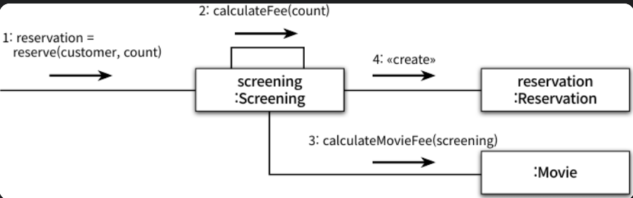

# 🔶 1. 영화 예매 시스템

### 요구사항

- 영화: 영화에 대한 기본 정보 (제목, 상영시간, 가격정보)
- 상영: 실제로 관객들이 영화를 관람하는 사건 (상영일자, 시간, 순번)
- 사용자가 실제로 예매하는 대상 → 상영

특정한 두가지 조건을 만족하는 예매자는 요금을 할인받을 수 있다.

1. 할인 조건 (discount condition)
2. 할인 정책 (dicsount policy)

### 할인 조건

'할인 조건'은 가격의 할인 여부를 결정하며 '순서 조건'과 '기간 조건'의 두 종류로 나눌 수 있다.

1. '순서 조건': 상영 순번을 이용해 할인 여부를 결정하는 규칙이다.(ex. 순서조건의 순번이 10번이면 매일 10번째로 상영되는 영화를 예매하면 할인 혜택 제공)
2. '기간 조건': 영화 상영 시작 시간을 이용해 할인 여부를 결정한다.(ex. 월요일 오전10시 ~ 오후 1시 까지 모든 영화에 대해 할인 혜택 제공)

### 할인 정책

'할인 정책'은 할인 조건에 부합할 때, 할인 요금을 어떤 방식으로 책정할지 결정한다.

할인 정책은 '금액 할인 정책'과 '비율 할인 정책'이 있다.

1. '금액 할인 정책'은 예매 요금에서 일정 금액을 할인해준다.
2. '비율 할인 정책'은 정가에서 일정 비율의 요금을 할인해준다.

영화별로 하나의 할인 정책만 할당할 수 있다. 물론 할인 정책을 지정하지 않는 것도 가능하다.

이와 달리 할인 조건은 다수의 할인 조건을 함께 지정할 수 있다.

할인을 적용하기 위해서는 할인 조건과 할인 정책을 함께 조합해서 사용한다.

# 🔶 2. 객체지향 프로그래밍을 향해

### 🔷 협력, 객체, 클래스

진정한 객체지향 패러다임으로의 전환은 클래스가 아닌 **객체**에 초점을 맞출 때에만 얻을 수 있다.

- 어떤 클래스가 필요할지 고민하기 전에, 어떤 객체들이 필요한지 고민하라
- 객체를 독립적인 존재가 아니라 기능을 구현하기 위해 협력하는 공동체의 일원으로 봐야 한다
- 객체들의 모양과 윤곽이 잡히면 공통된 특성과 상태를 가진 객체들을 타입으로 분류하고 이 타입을 기반으로 클래스를 구현하라.

### 🔷 도메인의 구조를 따르는 프로그램 구조

- **도메인(domain)** : 문제를 해결하기 위해 사용자가 프로그램을 사용하는 분야
- 객체지향 패러다임이 강력한 이유는 **요구사항을 분석하는 초기 단계부터 프로그램을 구현하는 마지막 단계까지 객체라는 동일한 추상화 기법을 사용할 수 있기 때문이다.**
- 일반적으로 클래스의 이름은 대응되는 도메인 개념의 이름과 동일하거나 적어도 유사하게 지어야 한다

- 영화 예매 도메인을 구성하는 타입들의 구조
    
    
    
- 도메인 개념의 구조를 따르는 클래스 구조
    
    
    

### 🔷 클래스 구현하기

- Screening 클래스
    
    ```java
    public class Screening {
            // 상영할 영화
        private Movie movie;
            // 하루동안 상영하는 영화 중 몇번째로 상영하는지
        private int sequence;
            // 상영 시간
        private LocalDateTime whenScreened;
    
        public Screening(Movie movie, int sequence, LocalDateTime whenScreened) {
            this.movie = movie;
            this.sequence = sequence;
            this.whenScreened = whenScreened;
        }
    
        public LocalDateTime getStartTime() {
            return whenScreened;
        }
    
        public boolean isSequence(int sequence) {
            return this.sequence == sequence;
        }
    
        public Money getMovieFee() {
            return movie.getFee();
        }
            // 예매한 후 예매 정보를 담고 있는 Reservation의 인스턴스를 생성해서 반환함
        public Reservation reserve(Customer customer, int audienceCount) {
            return new Reservation(customer, this, calculateFee(audienceCount),
                    audienceCount);
        }
            // 요금을 계산해줌
        private Money calculateFee(int audienceCount) {
            return movie.calculateMovieFee(this).times(audienceCount);
        }
    }
    ```
    
- 인스턴스 변수의 가시성은 private이고, 메서드의 가시성은 public이다
- 클래스의 내부와 외부를 구분해야 하는 이유
    - 경계의 명확성이 객체의 자율성을 보장
    - 프로그래머에게 구현의 자유 제공

**자율적인 객체**

- 객체가 상태state와 행동behavior를 함께 가지는 복합적인 존재
- 객체가 스스로 판단하고 행동하는 자율적인 존재

- 캡슐화: 데이터와 기능을 객체 내부로 함께 묶는 것
- 접근 제어: 외부에서의 접근을 통제할 수 있는 접근 제어
    - 접근 수정자 활용

- 객체 내부에 대한 접근을 통제하는 이유
    - 객체는 자율적인 존재이기 때문에 외부의 간섭을 최소화해야 한다
    - 객체에게 원하는 것을 요청하고는, 객체가 스스로 최선의 방법을 결정할 수 있을 것이라는 점을 믿고 기다려야 한다

- 객체의 분리: 인터페이스와 구현의 분리 원칙
    - 퍼블릭 인터페이스 public interface: 외부에서 접근 가능
    - 구현 interface: 오직 내부에서만 접근 가능
    
    ⇒ 일반적으로 객체의 상태는 숨기고 행동만 외부에 공개ㅐ야 한다
    

**프로그래머의 자유**

프로그래머의 역할을 클래스 작성자와 클라이언트 프로그래머로 구분하는 것이 유용하다

- 클래스 작성자: 새로운 데이터 타입을 프로그램에 추가
- 클라이언트 프로그래머: 클래스 작성자가 추가한 데이터 타입을 사용

- 접근 제어 매커니즘
    - 구현 은닉: 내부의 구현은 무시한 채 인터페이스만 알고 있어도 클래스 사용 가능
    - 클래스 작성자가 인터페이스를 바꾸지 않는 한, 내부 구현을 마음대로 변경할 수 있다

### 🔷 협력하는 객체들의 공동체

- Money 클래스
    
    ```java
    public class Money {
        public static final Money ZERO = Money.wons(0);
    
        private final BigDecimal amount;
    
        public static Money wons(long amount) {
            return new Money(BigDecimal.valueOf(amount));
        }
    
        public static Money wons(double amount) {
            return new Money(BigDecimal.valueOf(amount));
        }
    
        Money(BigDecimal amount) {
            this.amount = amount;
        }
    
        public Money plus(Money amount) {
            return new Money(this.amount.add(amount.amount));
        }
    
        public Money minus(Money amount) {
            return new Money(this.amount.subtract(amount.amount));
        }
    
        public Money times(double percent) {
            return new Money(this.amount.multiply(BigDecimal.valueOf(percent)));
        }
    
        public boolean isLessThan(Money other) {
            return amount.compareTo(other.amount) < 0;
        }
    
        public boolean isGreaterThanOrEqual(Money other) {
            return amount.compareTo(other.amount) >= 0;
        }
    
        public boolean equals(Object object) {
            if (this == object) {
                return true;
            }
    
            if (!(object instanceof Money)) {
                return false;
            }
    
            Money other = (Money)object;
            return Objects.equals(amount.doubleValue(), other.amount.doubleValue());
        }
    
        public int hashCode() {
            return Objects.hashCode(amount);
        }
    
        public String toString() {
            return amount.toString() + "원";
        }
    }
    ```
    

금액을 구현하기 위해 기본 타입을 사용하는 경우, 구현 관점의 제약(ex. Long → 변수의 크기)은 표현할 수 있지만 Money 타입처럼 저장하는 값이 금액과 관련되어 있다는 의미를 전달할 수 없다.

또한 금액과 관련된 로직이 서로 다른 곳에 중복되어 구현되는 것을 막을 수 없다.

⇒  객체지향의 장점은 Money처럼 **객체를 이용해 도메인의 의미를 풍부하게 표현할 수 있다**

- Reservation 클래스
    
    ```java
    public class Money {
        public static final Money ZERO = Money.wons(0);
    
        private final BigDecimal amount;
    
        public static Money wons(long amount) {
            return new Money(BigDecimal.valueOf(amount));
        }
    
        public static Money wons(double amount) {
            return new Money(BigDecimal.valueOf(amount));
        }
    
        Money(BigDecimal amount) {
            this.amount = amount;
        }
    
        public Money plus(Money amount) {
            return new Money(this.amount.add(amount.amount));
        }
    
        public Money minus(Money amount) {
            return new Money(this.amount.subtract(amount.amount));
        }
    
        public Money times(double percent) {
            return new Money(this.amount.multiply(BigDecimal.valueOf(percent)));
        }
    
        public boolean isLessThan(Money other) {
            return amount.compareTo(other.amount) < 0;
        }
    
        public boolean isGreaterThanOrEqual(Money other) {
            return amount.compareTo(other.amount) >= 0;
        }
    
        public boolean equals(Object object) {
            if (this == object) {
                return true;
            }
    
            if (!(object instanceof Money)) {
                return false;
            }
    
            Money other = (Money)object;
            return Objects.equals(amount.doubleValue(), other.amount.doubleValue());
        }
    
        public int hashCode() {
            return Objects.hashCode(amount);
        }
    
        public String toString() {
            return amount.toString() + "원";
        }
    }
    ```
    

영화를 예매하기 위해 Screening, Movie, Reservation 인스턴스들은 서로의 메서드를 호출하며 상호작용한다

- **협력**: 시스템의 어떤 기능을 구현하기 위해 객체들 사이에 이뤄지는 상호작용



### 🔷 협력에 관한 짧은 이야기

- 객체 간에 상호작용할 수 있는 유일한 방법은 **메시지를 전송하는** 것과 **메시지를 수신하는** 것 뿐이다
- **메서드**: 수신된 메시지를 처리하기 위한 자신만의 방법
- 메시지와 메서드를 명확히 구분 → 다형성

# 🔶 할인 요금 구하기

### 🔷 할인 요금 계산을 위한 협력 시작하기

지금까지는 Screening이 Movie의 calculateMovieFee라는 '메서드를 호출한다'고 말했지만 사실은 Screening이 Movie에게 **calculateMovieFee '메시지를 전송한다'**라고 말하는 것이 더 적절하다.

사실 Screening은 Movie안에 calculateMovieFee 메서드가 존재하는지 모른다. 단지 **Movie가 calculateMovieFee 메시지에 응답할 수 있다고 믿고 메시지를 전송할 뿐이다.**

### 🔷 할인 정책과 할인 조건

- 할인 정책은 금액 할인 정책과 비율 할인 정책으로 구분된다.
- 부모 클래스인 DiscountPolicy 안에 중복 코드를 두고 AmountDiscountPolicy, PercentDiscountPolicy가 이 클래스를 상속받게 할 것이다.
- 실제 애플리케이션에서는 DiscountPolicy의 인스턴스를 생성할 필요가 없기 때문에 **추상 클래스(abstract class)**로 구현했다.

- 추상 클래스 DiscountPolicy
    
    ```java
    public abstract class DiscountPolicy {
        private List<DiscountCondition> conditions = new ArrayList<>();
    
        public DiscountPolicy(DiscountCondition ... conditions) {
            this.conditions = Arrays.asList(conditions);
        }
    
        public Money calculateDiscountAmount(Screening screening) {
            for(DiscountCondition each : conditions) {
                if (each.isSatisfiedBy(screening)) {
                    return getDiscountAmount(screening);
                }
            }
    
            return Money.ZERO;
        }
            // 금액, 비율 할인정책이 이 메서드를 상속받아 다른 방식으로 구현해야함
        abstract protected Money getDiscountAmount(Screening Screening);
    }
    ```
    

- **TEMPLATE METHOD 패턴:** 부모 클래스에 기본적인 알고리즘의 흐름을 구현하고, 중간에 필요한 처리를 자식 클래스에 위임하는 디자인 패턴

### 🔷 할인 정책 구성하기

- 하나의 영화에 대해 단 하나의 할인 정책만 설정 가능
- 할인 조건의 경우에는 여러 개의 정책 적용 가능
- 생성자의 파라미터 목록을 이용해 초기화에 필요한 정보를 전달하도록 강제할 수 있다

# 🔶 4. 상속과 다형성

### 🔷 컴파일 시간 의존성과 실행 시간 의존성

- **의존성**: 어떤 클래스가 다른 클래스에 접근할 수 있는 경로를 가지거나, 해당 클래스의 객체의 메서드를 호출할 경우 두 클래스 사이에 의존성이 존재한다고 말한다.

영화 할인 정책이 금액과 비율 어떤것을 기준으로 하는지 알기 위해서는 `AmountDiscountPolicy`, `PercentDiscontPolicy` 중 하나랑 연결되어야한다.


- Movie가 영화 요금을 계산하기 위해서는 DiscountPolicy가 아니라 그 자식 클래스가 필요하다.
    - Movie는 DiscountPolicy의 자식 클래스에 의존해야 한다.
- 하지만 코드 수준에서 Movie는 두 클래스 중 어떤 것에도 의존하지 않는다.
    - DiscountPolicy를 통해서 두 클래스 중 어떤것이든 될 수 있기 때문에 Movie 인스턴스를 생성해줄 때 DiscountPolicy의 자리에 자식 클래스를 사용하면 된다.
    - Movie는 DiscountPolicy의 자식클래스를 의존하게 될 것이다.

UML로 따졌을때는 Movie가 DiscountPolicy를 의존하고 있지만, 객체를 만들고나면 자식클래스를 의존하게 되므로 달라진다.

즉, **클래스 사이의 의존성과 객체 사이의 의존성은 동일하지 않을 수 있다. (코드의 의존성과 실행 시점의 의존성이 서로 다를 수 있다)**

- 코드의 의존성과 실행 시점의 의존성이 다르면 다를수록 (= 설계가 유연해질수록)
    1. 코드를 이해하기 어려워진다. (단점)
    2. 코드는 더 유연해지고 확장 가능해진다. (장점)
- 설계가 유연해질수록
    1. 디버깅 하기 어려워진다.
    2. 재사용성과 확장 가능성이 높아진다.

### 🔷 차이에 의한 프로그래밍

부모 클래스와 다른 부분만을 추가해서 새로운 클래스를 쉽고 빠르게 만드는 방법

- 상속은 부모 클래스의 구현을 공유하면서도 행동이 다른 자식 클래스를 쉽게 추가할 수 있다.

### 🔷 상속과 인터페이스

- **상속**: 부모 클래스가 제공하는 모든 인터페이스를 자식 클래스가 물려받을 수 있다
- **인터페이스**: 객체가 이해할 수 있는 메시지의 목록을 정의
    - 객체 입장에서는 자신과 협력하는 객체가 어떤 클래스의 인스턴스인지가 중요한 것이 아니라, loveLakku 메시지를 수신할 수 있다는 것이 중요하다
- 자식 클래스는 상속을 통해 부모 클래스가 수신할 수 있는 모든 메시지를 수신할 수 있다
    - **외부 객체는 자식 클래스를 부모 클래스와 동일한 타입으로 간주할 수 있다**
    - **업캐스팅 : 자식 클래스가 부모 클래스를 대신함**


### 🔷 다형성

메시지와 메서드는 다른 개념이다

`Movie`는 `DiscountPolicy`의 인스턴스에게 `calculateDiscountAmount` 메시지를 전송한다.

저 메시지에 의해 실행되는 메서드는 `AmountDiscountPolicy`, `PercentDiscountPolicy`둘 중 오버라이딩한 메서드가 실행될 것이다.

다시 말해서 Movie는 동일한 메시지를 전송하지만 실제로 어떤 메서드가 실행될 것인지는 메시지를 수신하는 객체의 클래스가 무엇이냐에 따라 달라진다.

- **다형성: 동일한 메시지를 수신했을 때 객체의 타입에 따라 다르게 응답할 수 있는 능력**
    - 다형적 협력에 참여하는 객체들은 모두 같은 메시지를 이해할 수 있어야 한다
    - 인터페이스가 동일해야 한다 → 이를 통일하기 위한 방법이 상속
    - 지연바인딩 사용 → 컴파일 시점의 의존성과 실행 시점의 의존성을 분리하고, 하나의 메시지를 선택적으로 서로 다른 메서드에 연결할 수 있는 이유

**바인딩의 종류**

- 지연 바인딩: 메시지와 메서드를 실행 시점에 바인딩
- 정적 바인딩: 컴파일 시점에 실행될 함수나 프로시저를 결정하는 것

### 🔷 구현 상속과 인터페이스 상속

- 구현 상속 (서브클래싱): 순수하게 코드 재사용 목적으로 상속을 사용하는 것
- 인터페이스 상속 (서브타이핑): 다양한 협력을 위해 부모 클래스와 자식 클래스가 인터페이스를 공유할 수 있도록 상속을 이용하는 것

⇒ 상속은 인터페이스 상속을 위해 사용되어야 한다

### 🔷 인터페이스와 다형성

**인터페이스**

- (java) 구현에 대한 고려 없이 다형적인 협력에 참여하는 클래스들이 공유 가능한 외부 인터페이스
- (c++) 추상 기반 클래스

`DiscountCondition` 인터페이스를 실체화하고 있는 `SequenceCondition`과 `PeriodCondition`은 동일한 인터페이스를 공유하여 다형적인 협력에 참여 가능


# 🔶 5. 추상화와 유연성

### 🔷 추상화의 힘

같은 계층에 속하는 클래스들이 공통으로 가질 수 있는 인터페이스를 정의하여 구현의 일부 (추상클래스인 경우) 또는 전체 (자바 인터페이스인 경우)를 자식클래스가 결정할 수 있도록 결정권을 위임

**추상화의 장점**

- 추상화의 계층만 따로 살펴보며 요구사항의 정책을 높은 수준에서 서술 가능
- 설계가 좀 더 유연해짐


위의 그림을 하나의 문장으로 정리하면 "영화 예매 요금은 최대 하나의 '할인 정책'과 다수의 '할인 조건'을 이용해 계산할 수 있다."로 표현할 수 있다

위의 문장에서 '두개의 순서조건, 한개의 기간조건'이라는 조건을 좀 더 추상적인 개념들을 사용해서 문장을 작성했다는 사실이 중요하다.

**추상화를 사용하면 세부적인 내용을 무시한 채 상위 정책을 쉽고 간단하게 표현할 수 있다.** 이러한 특징은 상위개념만으로도 도메인의 중요한 개념을 설명할 수 있게 해준다. 추상화를 이용한 설계는 필요에 따라 표현의 수준을 조정하는 것을 가능하게 해준다.

**추상화를 이용해 상위 정책을 기술한다는 것은 기본적인 애플리케이션의 협력 흐름을 기술한다는것을 의미한다.**

예매 가격을 계산하기 위한 흐름은 항상 Movie → DiscountPolicy로 흐르고, 다시 DiscountCondition을 향해 흐른다.

할인 정책이나 할인 조건의 새로운 자식 클래스들은 추상화를 이용해서 정의한 상위 협력 흐름을 그대로 따르게 된다. 이 개념은 매우 중요한데, 재사용 가능한 설계의 기본을 이루는 **디자인 패턴(design pattern)**이나 **프레임워크(framework)** 모두 추상화를 이용해 상위 정책을 정의하는 객체지향의 메커니즘을 활용하고 있기 때문이다.

두 번째 특징은 첫 번째 특징으로부터 유추할 수 있다.

추상화를 이용해 상위 정책을 표현하면 **기존 구조를 수정하지 않고도 새로운 기능을 쉽게 추가하고 확장할 수 있다.** 다시 말해 설계