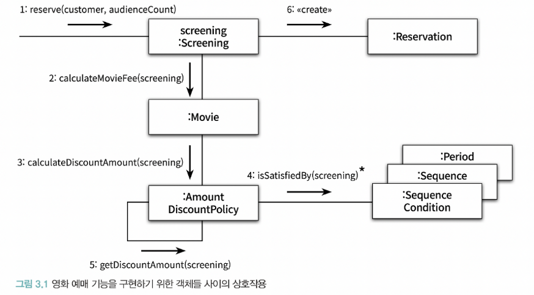
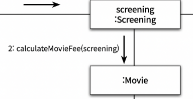
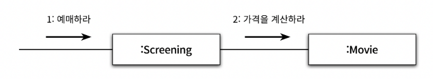
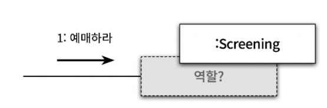
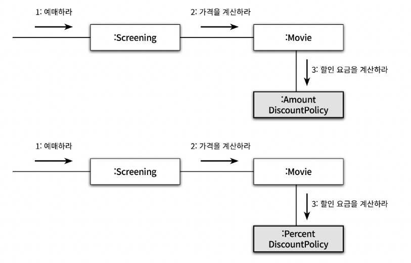
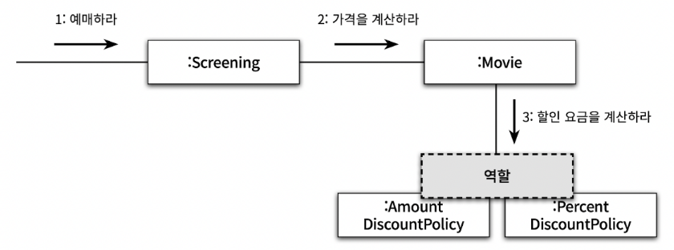

# 3장. 역할, 책임, 협력

- 협력: 객체들이 애플리케이션의 기능을 구현하기 위해 수행하는 상호작용
- 책임: 객체가 협력에 참여하기 위해 수행하는 로직
- 역할: 객체들이 협럭 안에서 수행하는 책임이 모인 것

&nbsp;

# 🔷 협력

애플리케이션의 제어 흐름은 어떤 하나의 객체에 의해 통제되지 않고 다양한 객체들 사이에 균형 있게 분배되는 것이 일반적이다.

### 🔻협력
- 객체는 다른 객체의 내부 구현에 직접 접근할 수 없기 때문에 오직 **메시지 전송**을 통해서만 자신의 요청을 전달할 수 있다
- 메시지를 수신한 객체는 **메서드**를 실행해 요청에 응답한다: 이 떄 객체가 메시지를 처리할 방법을 스스로 선택한다.

- 메시지를 사용하지 않는 경우
   - Screening이 Movie의 인스턴스 변수에 직접 접근해야 한다
   - Screening은 Movie의 내부 구현에 결합되어 버림
   - Movie의 자율성 훼손

- 따라서 객체를 자율적으로 만들기 위해서는 내부 구현을 **캡슐화**해야 한다
  - 캡슐화를 통해 변경에 대한 파급효과 제한
  - 결합도를 느슨하게 유지

### 🔻 협력이 설계를 위한 문맥을 결정한다
> **어떤 객체도 짐이 아니다**
- 애플리케이션 안에 어떤 객체가 필요하다면 그 이유는 그 객체가 어떤 협력에 참여하고 있기 때문이다
- 객체가 협력에 참여할 수 있는 이유는 협력에 필요한 적절한 행동을 보유하고 있기 때문이다
- **객체의 행동을 결정하는 것은 객체가 참여하고 있는 협력**이다.
  - 협력이 바뀌면 객체가 제공해야 하는 행동 역시 바뀌어야 한다
  - 객체가 필요한 이유와 객체가 수행하는 행동의 동기를 제공한다

- 객체의 상태를 결정하는 것은 행동이다
  - 객체의 상태는 그 객체가 행동을 수행하는 데 필요한 정보가 무엇인지로 결정된다
  - 객체는 수행하는 행동에 필요한 상태도 가지고 있어야 한다

- **결과적으로 객체가 참여하는 협력이 객체의 행동과 상태를 모두 결정한다.** 
- 협력이 객체 설계의 **문맥**을 제공하는 것이다.

&nbsp;

# 🔷 책임
- 객체에 정의되는 응집도 있는 행위의 집합
- 객체가 유지해야 하는 정보와 수행할 수 있는 행동에 대해 개략적으로 서술한 문장
- **하는 것**과 **아는 것**

- 책임은 객체가 수행할 수 있는 행동을 종합적이고 간략하게 서술하기 때문에, 메시지보다 추상적이고 개념적으로도 더 크다
- 책임의 관점에서 '아는 것'과 '하는 것'이 밀접하게 연관되어 있다
  - 자신이 할 수 없는 작업을 도와줄 객체를 알고 있을 책임이 있다
  - 어떤 책임을 수행하기 위해서는 그 책임을 수행하는 데 필요한 정보도 함께 알아야 할 책임이 있는 것이다

### 🔻 책임 할당
> 책임을 할당한다는 것은 메시지의 이름을 결정하고, 해당 메시지에 응답할 객체를 결정하는 것이다

**◼ 정보 전문가 패턴**  
책임을 수행하는 데 필요한 정보를 가장 잘 알고 있는 전문가에게 그 책임을 할당하는 것

1. 시스템이 사용자에게 제공하는 기능을 하나의 책임으로 바라보기
2. 책임을 할당하기 (메시지의 이름을 결정하기)
3. 메시지를 처리할 적절한 객체를 선택하기
4. 3과 4를 반복

### 🔻 책임 주도 설계
책임을 찾고 책임을 수행할 적절한 객체를 찾아 책임을 할당하는 방식으로 협력을 설계하는 방법
- 시스템이 사용자에게 제공해야 하는 기능인 시스템 책임을 파악한다
- 시스템 책임을 더 작은 책임으로 분할한다
- 분할된 책임을 수행할 수 있는 적절한 객체 또는 역할을 찾아 책임을 할당한다
- 객체가 책임을 수행하는 도중, 다른 객체의 도움이 필요한 경우 이를 책임질 적절한 객체 또는 역할을 찾는다
- 해당 객체 또는 역할에게 책임을 할당함으로써 두 객체가 협력하게 한다

&nbsp;

**◼ 책임 할당 시 고려사항**
1. 메시지가 객체를 결정한다
- 객체가 최소한의 인터페이스를 가질 수 있게 된다
- 객체는 충분히 추상적인 인터페이스를 가질 수 있게 된다
1. 행동이 상태를 결정한다
- 객체가 존재하는 이유는 협력에 참여하기 위해서이다.
- 객체는 협력에 필요한 행동을 제공해야만 한다
- 객체를 객체답게 만드는 것은 객체의 상태가 아니라 다른 객체에게 제공하는 행동이다. 

&nbsp;

**◼ 데이터 주도 설계**
- 내부 구현을 변경하는 것
- 객체 > 퍼블릭 인터페이스 > 클라이언트로 변경의 영향이 전파된다

# 🔷 역할
### 🔻 역할과 협력
객체가 어떤 특정한 협력 안에서 수행하는 책임의 집합을 **협력**이라고 한다

 
역할을 찾은 후, 그 역할을 수행할 수 있는 객체를 선택하는 방식

### 🔻 유연하고 재사용 가능한 협력
- 역할이 없는 경우 코드 중복 발생

- 협력 안에서 여러 종류의 객체를 교대로 바꿔 끼울 수 있는 일종의 슬롯(역할) 사용

◼ 역할의 구현
- 가장 일반적인 방법은 추상클래스와 인터페이스를 사용하는 것
- 추상클래스: 역할을 수행할 수 있는 모든 객체들이 공유하는 상태와 행동의 기본 구현이 존재하는 경우
- 인터페이스: 공통의 구현이 필요없고 단지 책임의 목록만 정의하면 되는 경우

- **협력을 구체적인 객체가 아니라 추상적인 관점에서 설계하면 협력이 유연하고 재사용가능해진다는 것이다**
- 역할의 가장 큰 장점은 설계의 구성 요소를 추상화할 수 있다는 것이다

### 🔻 역할과 추상화
1. 세부 사항에 억눌리지 않고도 상위 수준의 정책을 쉽고 간단하게 표현할 수 있다
2. 설계를 유연하게 만들 수 있다 (역할을 일종의 슬롯으로 생성)

### 🔻 배우와 배역
연극의 배역과 배우 간의 관계에 다음과 같은 특성이 존재 한다.

- 배역은 연극 배우가 특정 연극에서 연기하는 역할이다.
- 배역은 연극이 상영되는 동안에만 존재하는 일시적인 개념이다.
- 연극이 끝나면 연극 배우는 배역이라는 역할을 벗어 버리고 원래의 연극 배우로 돌아온다.

위의 사실로부터 연극의 배역과 배우간에는 다음과 같은 추가적인 특성이 존재한다는 사실을 알 수 있다.

- 역할은 객체가 협력에 참여하는 잠시 동안에만 존재하는 일시적인 개념이다
- 역할은 오직 시스템의 문맥 안에서 무엇을 하는지에 의해서만 정의될 수 있다
- 역할은 객체의 페르소나이다.

- 서로 다른 배우들이 동일한 배역을 연기할 수 있다. = 동일한 역할을 수행하는 객체들은 서로 대체 가능하다
- 하나의 배우가 다양한 연극 안에서 서로 다른 배역을 연기할 수 있다. = 객체는 여러 역할을 가질 수 있다.

역할은 특정한 객체의 종류를 캡슐화하기 때문에 동일한 역할을 수행하고 계약을 준수하는 대체 가능한 객체들은 다형적이다.