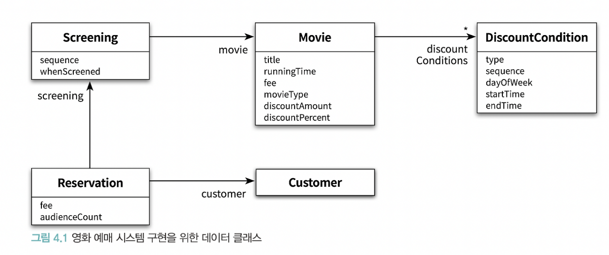
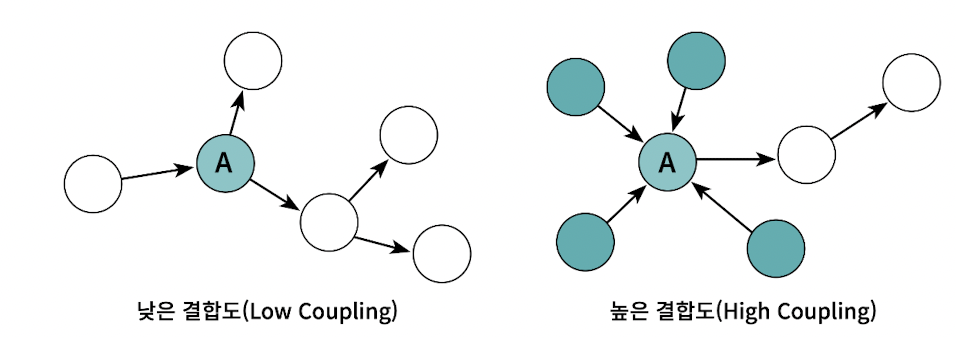
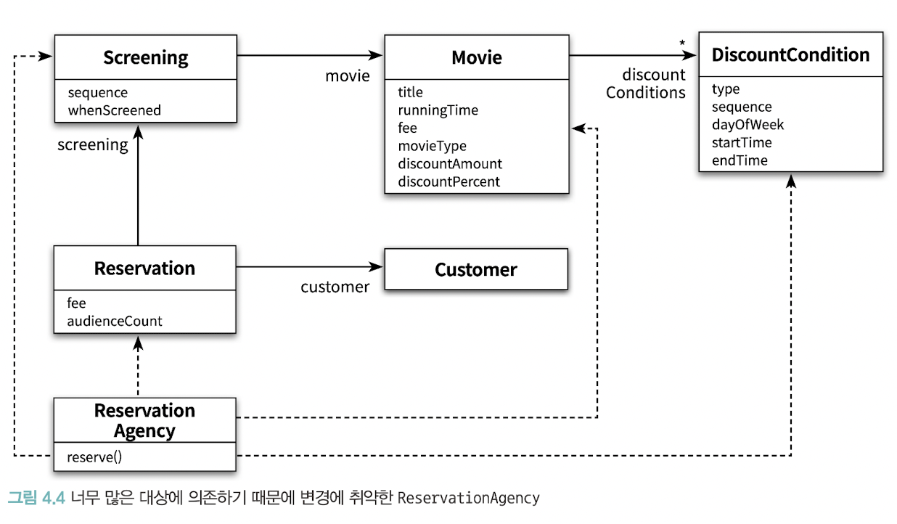
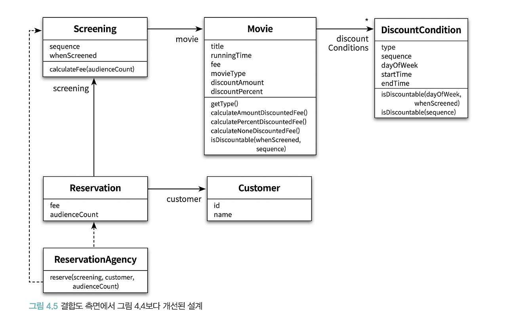

# 4장. 설계 품질과 트레이드오프

**가장 중요한 것은 책임이다**
- 객체지향 설계란 올바른 객체에게 올바른 책임을 할당하면서 낮은 결합도와 높은 응집도를 가진 구조를 창조하는 활동이다
- 1) 객체지향 설계의 핵심이 책임이다
- 2) 책임을 할당하는 작업이 응집도와 결합도 같은 설계 품질과 깊이 연관
- 훌륭한 설계를 위해서는 객체의 상태가 아니라 객체의 행동에 초점을 맞춰야 한다

## 🔷 1. 데이터 중심의 영화 예매 시스템
### 🔻 시스템을 객체로 분할하는 방법
1) 데이터(상태) 중심 관점
- 객체는 자신이 포함하고 있는 데이터를 조작하는데 필요한 오퍼레이션을 정의
- 객체의 상태에 초점
- 객체 = 독립된 데이터 덩어리
2) 책임 중심 관점
- 객체는 다른 객체가 요청할 수 있는 오퍼레이션을 위해 필요한 상태를 보관
- 객체의 행동에 초점
- 객체 = 협력하는 공동체의 일원

**훌륭한 객체지향 설계는 데이터가 아니라 책임에 초점을 맞춰야 한다**
  
### 🔻 데이터 중심 관점의 단점
> 변경에 취약하다
- 객체의 상태는 구현 > 구현은 불안정하기 때문에 변하기 쉽다
- 구현에 관한 세부 사항이 객체의 인터페이스에 스며들게 되어 캡슐화의 원칙이 무너짐
- 상태 변경 > 인터페이스의 변경 > 인터페이스에 의존하는 모든 객체에게 변경 영향 전파

### 🔻 책임 중심 관점의 장점
- 객체의 책임은 인터페이스에 속한다
- 객체는 상태를 캡슐화함으로써 구현 변경에 대한 파장이 외부로 퍼져나가는 것을 방지
- 변경에 안정적인 설계 얻음

### 🔻 예시
- 캡슐화를 위한 가장 간단한 방법은 접근자와 수정자를 추가하는 것이다


## 🔷 2. 설계 트레이드오프
> 캡슐화, 응집도, 결합도

### 🔻 캡슐화
> 변경 가능성이 높은 부분을 객체 내부로 숨기는 추상화 기법
- **변경할 수 있는 어떤 것이라도 캡슐화해야 한다**
- 변경 가능성이 높은 부분은 내부에 숨기고, 외부에는 상대적으로 안정적인 부분만 공개함으로써 변경의 여파를 통제 가능
- 구현: 변경될 가능성이 높은 부분
- 인터페이스: 상대적으로 안정적인 부분

### 🔻 응집도
- 모듈에 포함된 내부 요소들이 연관되어 있는 정도
- 객체 또는 클래스에 얼마나 관련 높은 책임들을 할당했는지
- 변경이 발생할 때 모듈 내부에서 발생하는 변경의 정도
- **응집도가 높을수록 변경의 대상과 범위가 명확해지기 때문에 코드를 변경하기 쉬워진다**


### 🔻 결합도
- 의존성의 정도. 다른 모듈에 대해 얼마나 많은 지식을 갖고 있는지 나타냄
- 객체 또는 클래스가 협력에 필요한 적절한 수준의 관계만을 유지하고 있는지
- **한 모듈이 변경되기 위해서 다른 모듈의 변경을 요구하는 정도**
- 클래스의 구현이 아닌, 인터페이스에 의존하도록 코드를 작성해야 낮은 결합도를 얻을 수 있다 (인터페이스에 대해 프로그래밍하라)
- 일반적으로 라이브러리나 성숙 단계의 프레임워크에 의존하면 결합도 높아도 상관없음
- 그러나 직접 작성한 코드는 항상 불안정하기 때문에 낮은 결합도를 유지하기 위해 노력 필요


&nbsp;

**좋은 설계란, 높은 응집도와 낮은 결합도를 가진 모듈로 구성된 설계**
**그것이 설계를 변경하기 쉽게 만들기 때문**

&nbsp;

**캡슐화를 지키면 모듈 안의 응집도는 높아지고 모듈 사이의 결합도는 낮아진다**

## 🔷 데이터 중심의 영화 예매 시스템의 문제점
### 🔻 캡슐화 위반
- 접근자, 수정자 메서드는 객체 내부의 상태에 대한 어떤 정보도 캡슐화하지 못한다
- get, set 메서드는 Movie 내부에 Money 타입의 fee라는 이름의 인스턴스 변수가 존재한다는 사실을 퍼블릭 인터페이스에 노골적으로 드러낸다
- 접근자와 수정자에 과도하게 의존하는 설계 방식 > 추측에 의한 설게 전략
- 객체가 수행할 책임이 아니라 내부에 저장할 데이터에 초점을 맞췄기 때문이다
```java
public class Movie {
	private Money fee;
    
    public Money getFee() {
    	return fee;
    }
    
    public void setFee(Money fee) {
    	this.fee = fee;
    }
}

```

### 🔻 높은 결합도
- 객체 내부의 구현이 객체의 인터페이스에 드러난다는 것은 클라이언트가 구현에 강하게 결합된다는 것을 의미
- 단지 객체의 내부 구현을 변경했음에도 이 인터페이스에 의존하는 모든 클라이언트들도 함게 변경해야 한다

- 대부분의 제어 로직을 갖는 `ReservationAgency`가 모든 데이터 객체에 의존
- `DiscountCondition`의 데이터가 변경되면 `ReservationAgency`도 변경 필요


### 🔻 낮은 응집도
> 서로 다른 이유로 변경되는 코드가 모듈 안에 공존하면 응집도가 낮다

- 변경의 원인이 다른 코드들이 하나의 모듈 안에 뭉쳐있어 변경과 아무 상관 없는 코드들이 영향을 받는다.
- 하나의 요구사항 변경을 위해 여러 모듈을 동시에 수정해야 한다.

## 🔷 4. 자율적인 객체를 향해
### 🔻 캡슐화를 지켜라
- 객체는 자신이 어떤 데이터를 가지고 있는지를 내부에 캡슐화하고 외부에 공개해서는 안된다. 
- 객체는 스스로의 상태를 책임져야 하며 외부에서는 인터페이스에 정의된 메서드를 통해서만 상태에 접근할 수 있어야 한다.

```java
// 문제코드: 코드 중복 발생 및 변경에 취약
class AnyClass{
	void anyMethod(Rectangle rectangle, int multiple){
        rectangle.setRight(rectangle.getRight()*multiple)
        rectangle.setBottom(rectangle.getBottom()*multiple)
   }
}
```

```java
// 캡슐화 강화
class Rectangle{
   public void enlarge(int multiple){
   		right *= multiple;
        bottom *= multiple; 
   }
}
```

### 🔻 스스로 자신의 데이터를 책임지는 객체
> 객체 내부 데이터보다, 객체가 협력하며 수행할 책임을 정의하는 오퍼레이션이 더 중요
- 이 객체가 어떤 데이터를 포함해야 하는가?
- 이 객체가 데이터에 대해 수행해야 하는 오퍼레이션은 무엇인가?

- 내부 구현을 더 면밀하게 캡슐화 시키자.
- 데이터를 처리하는 데 필요한 메서드를 데이터를 가지고 있는 객체 스스로 구현하게 만들자


&nbsp;



## 🔷 데이터 중심 설계의 문제점
- 본질적으로 너무 이른 시기에 데이터에 관해 결정하도록 강요한다.
- 협력이라는 문맥을 고려하지 않고 객체를 고립시킨 채 오퍼레이션을 결정한다.

### 🔻 데이터 중심 설계는 객체의 행동보다는 상태에 초점을 맞춘다
데이터 중심의 관점에서 객체는 그저 단순한 데이터의 집합체일 뿐이다. 이로 인해 접근자와 수정자를 과도하게 추가하게 되고 이 데이터 객체를 사용하는 절차를 분리된 별도의 객체 안에 구현하게 된다.
<br>
결론적으로 데이터 중심의 설계는 너무 이른 시기에 데이터에 대해 고민하기 때문에 캡슐화에 실패하게 된다. 객체의 내부 구현이 객체의 인터페이스를 어지럽히고 객체의 응집도와 결합도에 나쁜 영향을 미치기 때문에 변경에 취약한 코드를 낳게 된다.

### 🔻데이터 중심 설계는 객체를 고립시킨 채 오퍼레이션을 정의하도록 만든다.
객체지향 애플리케이션을 구현하다는 것은 협력하는 객체들의 공동체를 구축한다는 것을 의미한다. 따라서 협력이라는 문맥 안에서 필요한 책임을 결정하고 이를 수행할 적절한 객체를 결정하는 것이 가장 중요하다.
<br>
올바른 객체지향 설계의 무게 중심은 항상 객체의 내부가 아니라 외부에 맞춰져 있어야 한다.