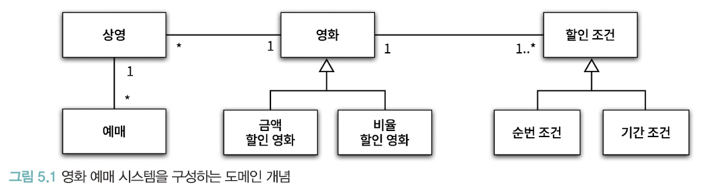
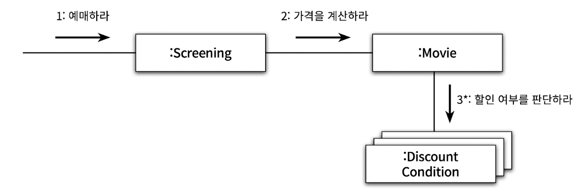
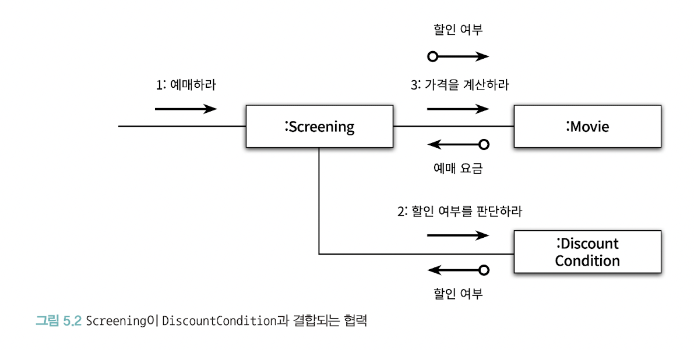
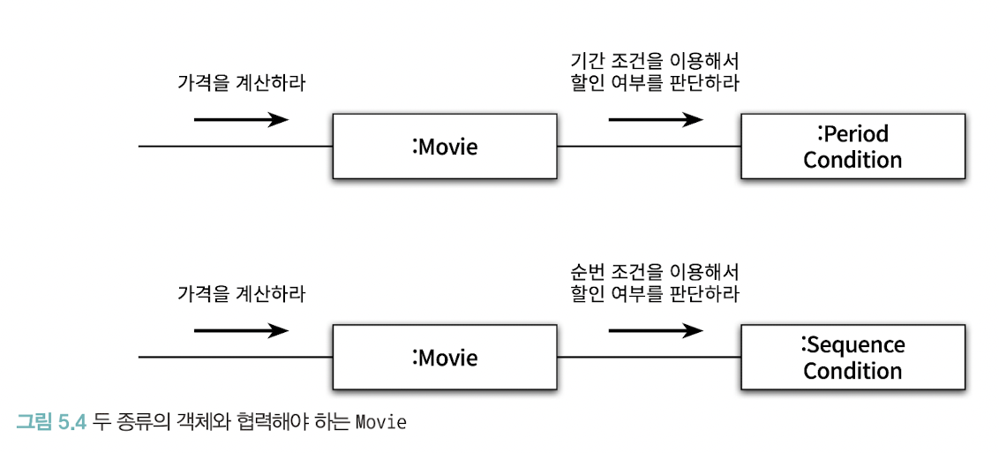
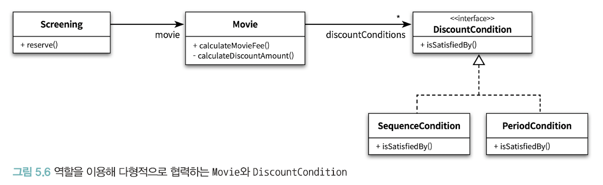
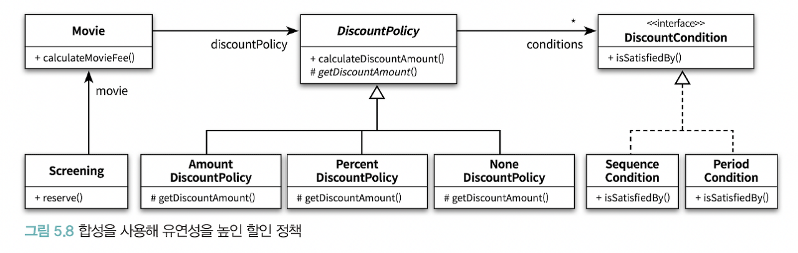

# 5장. 책임 할당하기

## 🔷 01. 책임 주도 설계를 향해
- 데이터보다 행동을 먼저 결정하라
- 협력이라는 문맥 안에서 책임을 결정하라

### 🔻 데이터보다 행동을 먼저 결정하라
- 객체에게 중요한 것은 데이터가 아니라 외부에 제공하는 행동이다
- 객체가 수행하는 행동 = 객체의 책임

<br>
- 이 객체가 수행해야 하는 책임은 무엇인가?
- 이 책임을 수행하는데 필요한 데이터는 무엇인가?

### 🔻 협력이라는 문맥 안에서 책임을 결정하라
- 객체에게 할당된 책임의 품질은 협력에 적합한 정도로 결정된다.
- 메시지를 전송하는 클라이언트의 의도에 적합한 책임을 할당해야 한다. 
- 협력에 적합한 책임을 수확하기 위해서는 메시지를 결정한 후에 객체를 선택해야 한다. 
- 메시지가 존재하기 때문에 그 메시지를 처리할 객체가 필요한 것이다.
- 객체가 메시지를 선택하는 것이 아니라 메시지가 객체를 선택하게 해야 한다.
<br>

**클라이언트는 어떤 객체가 메시지를 수신할 지 알지 못한다!**

## 🔷 2. 책임 할당을 위한 GRASP 패턴
GRASP(General Responsibility Assign Software Pattern) 패턴은 객체에게 책임을 할당할 때 지침으로 삼을 수 있는 원칙들의 집합을 패턴 형식으로 정리한 것이다.

### 🔻 도메인 개념에서 출발하기
- 도메인: 소프트웨어가 해결하고자 하는 문제


### 🔻 정보 전문가에게 책임을 할당하라
- 애플리케이션이 제공해야 하는 기능을 애플리케이션의 책임으로 생각하는 것이다.
- **INFORMATION EXPERT 정보 전문가**: 책임을 수행할 정보를 알고 있는 객체에게 책임을 할당하는 것
- 객체가 자율적인 존재라는 점을 상기: 정보를 알고 있는 객체만이 책임을 어떻게 수행할 지 스스로 결정 가능
- **정보는 데이터와 다르다**: 책임을 수행하는 객체가 정보를 '알고' 있다고 해서 그 정보를 '저장'하고 있을 필요는 없다
  - 정보 전문가가 데이터를 반드시 저장하고 있을 필요는 없다

### 🔻높은 응집도와 낮은 결합도
- 설계는 트레이드오프
- 여러 책임 할당을 함께 고려해야 한다
- 기존 설계: Movie가 Discountpolicy와 결합 - 이미 결합되어 있기 때문에 협럭 시 별도의 결합도 추가가 필요하지 않음
- 
- 후보 설계: Screening이 Discountpolicy와 결합 - Screening에 영화 요금 계산 책임이 분산되기 때문에 변경 여지 증가
- 
<br>

**LOW COUPLING 패턴**
- 설계의 전체적인 결합도가 낮게 유지되도록 책임 할당

**HIGH COHESION 패턴**
- 높은 응집도를 유지할 수 있게 책임 할당

### 🔻 창조자에게 객체 생성 패턴을 할당하라
> CREATOR(창조자) 패턴:객체를 생성할 책임을 어떤 객체에게 할당할지에 대한 지침을 제공한다.

**CREATOR 패턴**
아래 조건을 최대한 많이 만족하는 B에게 객체 생성 책임을 할당하라.

- B가 A 객체를 포함하거나 참조한다
- B가 A 객체를 기록한다
- B가 A 객체를 긴밀하게 사용한다
- B가 A 객체를 초기화하는데 필요한 데이터를 가지고 있다.(이 경우 B는 A에 대한 정보 전문가다)

## 🔷 03. 구현을 통한 검증
```java
public class DiscountCondition {
    private DiscountConditionType type;
    private int sequence;
    private DayOfWeek dayOfWeek;
    private LocalTime startTime;
    private LocalTime endTime;

    public boolean isSatisfiedBy(Screening screening) {
        if (type == DiscountConditionType.PERIOD) {
            return isSatisfiedByPeriod(screening);
        }

        return isSatisfiedBySequence(screening);
    }

    private boolean isSatisfiedByPeriod(Screening screening) {
        return dayOfWeek.equals(screening.getWhenScreened().getDayOfWeek()) &&
                startTime.compareTo(screening.getWhenScreened().toLocalTime()) <= 0 &&
                endTime.compareTo(screening.getWhenScreened().toLocalTime()) <= 0;
    }

    private boolean isSatisfiedBySequence(Screening screening) {
        return sequence == screening.getSequence();
    }
}
```

**문제점**
- isSatisfiedByPeriod와 isSatisfiedBySequence가 서로 다른 이유로, 다른 시점에 변경될 확률이 높다
=> 하나 이상의 변경 이유를 가지기 때문에 응집도가 낮다.

변경의 이유에 따라 클래스를 분리해야 한다. 
서로 다른 시점, 서로 다른 이유로 변경되는 코드들을 분리한다.

### 🔻코드를 통해 변경의 이유 파악하기
1) 인스턴스 변수가 초기화되는 시점 파악
- 응집도가 높은 클래스는 인스턴스를 생성할 때 모든 속성을 함께 초기화
- 응집도가 낮은 클래스는 일부만 초기화하고, 일부는 초기화하지 않은 상태로 남겨둠
=> 함께 초기화되는 속성을 기준으로 코드를 분리해야 한다
2) 메서드들이 인스턴스 변수를 사용하는 방식
- 모든 메서드가 객체의 모든 속성을 사용하면 클래스의 응집도는 높다
=> 속성 그룹과 해당 그룹에 접근하는 메서드를 기준으로 코드를 분리해야 한다

### 🔻 해결1: 타입 분리하기
DiscountCondition의 가장 큰 문제는 순번 조건과 기간 조건이라는 두개의 독립적인 타입이 하나의 클래스 안에 공존하고 있다는 점이다. <br>
해결 방법은 두 타입을 SequenceCondition, PeriodCondition 두 개의 클래스로 분리하는 것이다.

- sequence 속성만 사용하는 메서드 => SequenceCondition 이동
- dayOfWeek, startTime, endTime => PeriodCondition 이동
모든 메서드가 동일한 인스턴스 변수 그룹을 사용하도록 하여 응집도를 높인다.



이제 Movie는 두 클래스와 협력한다.

그러나 이 해결 방법은 아래와 같은 단점이 존재한다.
- 아는 클래스가 2개로 증가하여 결합도가 높아짐
- 목록 별로 넣는 로직이 필요해 구현이 귀찮아짐

### 🔻 해결2: 다형성을 통해 분리
- Movie 입장에서 둘은 할인 여부를 판단하는 동일한 책임을 수행할 뿐이다.
즉, 동일 책임을 수행하는 동일한 역할을 한다.
- 객체의 타입에 따라 변하는 행동이 있다면 (if) 타입을 분리하고 변화하는 행동을 각 타입의 책임으로 할당하면 된다.


**POLYMORPHISM 패턴**
- 객체의 타입의 따라 변하는 행동이 있는 경우: 타입을 분리하고 변화하는 행동을 각 타입의 책임으로 할당

**PROTECTED VARIATIONS 변경 보호 패턴**
> 변경을 캡슐화하도록 책임을 할당하는 것
- 예측 가능한 변경으로 인해 여러 클래스들이 불안정해진다면 해당 패턴을 사용하여 안정적인 인터페이스 뒤로 변경을 캡슐화하라
- Discount 인터페이스를 실체화하는 클래스를 추가하는 것만으로도 할인 조건의 종류를 확장할 수 있다

**역할을 사용하여 객체의 구체적인 타입 추상화**
- 추상 클래스: 역할을 대체할 클래스들 사이에서 구현 공유 필요
- 인터페이스: 구현을 공유할 필요 없이, 역할을 대체하는 객체들의 책임만 정의하고 싶은 경우

### 🔻 변경과 유연성
1) 코드를 이해하고 수정하기 쉽도록 최대한 단순하게 설계
2) 코드를 수정하지 않고도 변경을 수용할 수 있도록 코드를 더 유연하게 작성

<br>
대부분의 경우에는 전자가 더 좋은 방법이지만, 유사한 변경이 반복적으로 발생한다면 복잡성이 상승하더라도 유연성을 추가하는 두 번째 방법이 더 좋다
<br>
예시: 상속 대신 합성을 사용한 유연한 설계(DiscountPolicy 추가)


## 🔷 05. 책임 주도 설계의 대안
- 최대한 빠르게 목적한 기능을 수행하는 코드를 작성한 후, 리팩토링 진행
- 코드를 수정한 후에 겉으로 드러나는 동작이 바뀌어서는 안 된다

### 🔻 좋은 메서드란?
- 메서드가 잘게 나눠져 있을 때, 다른 메서드에서 사용될 확률이 높아진다
- 고수준의 메서드를 볼 때 일련의 주석을 읽는 것 같은 느낌
- 메서드가 잘게 나눠져 있을 때 오버라이딩하기 쉽다
- 뽑아내는 것이 코드를 더욱 명확하게 한다면, 새로 만든 메서드의 이름이 원래 코드의 길이보다 길어져도 뽑아낸다

### 🔻 객체를 자율적으로 만들자
- 자신이 소유하고 있는 데이터를 자기 스스로 처리하도록 만드는 것
- 메서드가 사용하는 데이터를 저장하고 있는 클래스로 메서드를 이동시킨다
- [tip] 메서드 안에서 어떤 클래스의 접근자 메서드를 사용하는지 파악하는 것

- 메서드를 다른 클래스로 이동시킬 때는 인자에 정의된 클래스 중 하나로 이동하는 경우가 일반적
```java
// 공통 인자로 DiscountCondition을 가지고 있음
public class ReservationAgency {
    private boolean isDiscountable(DiscountCondition condition, Screening screening) {
        if (condition.getType() == DiscountConditionType.PERIOD) {
            return isSatisfiedByPeriod(condition, screening);
        }
        return isSatisfiedBySequence(condition, screening);
    }

    private boolean isSatisfiedByPeriod(DiscountCondition condition, Screening screening) {
        // ... 
    }

    private boolean isSatisfiedBySequence(DiscountCondition condition, Screening screening) {
        // ...
    }
}
```
```java
public class DiscountCondition {
    private DiscountConditionType type; // 인스턴스 private으로 변경
    private int sequence;

    public boolean isDiscountable(Screening screening) {
          if (type == DiscountConditionType.PERIOD) {
            return isSatisfiedByPeriod(screening);
        }
        return isSatisfiedBySequence(screening);
    }

    
    private boolean isSatisfiedByPeriod(Screening screening) {
        // ... 
    }

    private boolean isSatisfiedBySequence(Screening screening) {
        // ...
    }
}
```