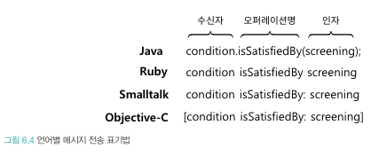
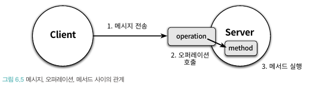

# 6장. 메시지와 인터페이스

- 객체지향 어플리케이션의 가장 중요한 재료는 클래스가 아니라 객체들이 주고받는 메시지
- 객체들이 수신하는 메시지들이 객체의 퍼블릭 인터페이스를 구성한다

## 🔷 01. 협력과 메시지
### 🔻 클라이언트-서버 모델
- 클라이언트-서버 모델: 메시지 전송 객체(클라이언트) <-> 메시지 수신 객체(서버)
- 협력: 클라이언트가 서버의 서비스를 요청하는 단방향 상호작용
- 객체가 다른 객체에게 접근할 수 있는 유일한 방법은 메시지를 전송하는 것 뿐이다
- 객체
  - 객체가 수신하는 메시지의 집합
  - 외부의 객체에게 전송하는 메시지의 집합 

### 🔻 메시지와 메시지 전송
> 메시지: 객체가 다른 객체와 협력하기 위해 사용하는 의사소통 매커니즘
- 메시지 전송: 한 객체가 다른 객체에게 도움을 요청하는 것
- 메시지 구성 요소: 오퍼레이션명(operation name), 인자(argument)
- 메시지 전송: 오퍼레이션 명 + 인자 + 메시지 수신자


### 🔻 메서드
> 메시지를 수신했을 때 실제로 실행되는 함수 또는 프로시저
- 코드 상에서 동일한 이름의 변수condition에게 동일한 메시지를 전송하더라도 객체의 타입에 따라 실행되는 메서드가 달라질 수 있다

### 🔻 퍼블릭 인터페이스와 오퍼레이션
> 퍼블릭 인터페이스: 객체가 의사소통을 위해 외부에 공개하는 메시지의 집합
- 오퍼레이션: 객체가 다른 객체에게 제공하는 **추상적인 서비스(인터페이스)**
  - 퍼블릭 인터페이스에 포함된 메시지
- 메서드: 메시지를 수신했을 때 실제로 실행되는 코드


### 🔻 시그니처
> 오퍼레이션이나 메서드의 명세(이름과 인자의 목록을 포함함)
- 오퍼레이션은 실행 코드 없이 시그니처만을 정의한 것
- 메서드는 이 시그니처에 구현을 더한 것
- 일반적으로 메시지를 수신하면 오퍼레이션의 시그니처와 동일한 메서드가 실행
- 오퍼레이션의 관점에서 다형성: 동일한 오퍼레이션 호출에 대해 서로 다른 메서드들이 실행되는 것

## 🔷 02. 인터페이스와 설계 품질
> 최소한의 인터페이스와 추상적인 인터페이스

### 🔻 디미터 법칙
> 객체의 내부 구조에 강하게 결합되지 않도록 협력 경로를 제한하는 것
- "오직 하나의 도트만 사용하라"
- 클래스 내부의 메서드가 아래 조건을 만족하는 인스턴스에만 메시지를 전송하도록 프로그래밍해야 한다
  - this 객체
  - 메서드의 매개변수
  - this의 속성
  - this의 속성인 컬렉션의 요소
  - 메서드 내에서 생성된 지역 객체


- 부끄럼타는 코드: 불필요한 어떤 것도 다른 객체에게 보여주지 않으며, `다른 객체의 구현에 의존하지 않는 코드`

<br>

**디미터 법칙을 위반하는 코드**
다음은 디미터 법칙을 위반하는 코드의 전형적인 모습이다. (기차 충돌)

```java
screening.getMovie().getDiscountConditions();
```

디미터 법칙을 따르도록 코드를 개선하면 메시지 전송자는 더 이상 메시지 수신자의 내부 구조에 관해 묻지 않게 된다.

```java
screening.calculateFee(audienceCount);
```
정보를 처리하는 데 필요한 책임을 정보를 알고 있는 객체에게 할당하기 때문에 응집도가 높은 객체가 만들어진다.

### 🔻 묻지 말고 시켜라
> 훌륭한 메시지는 객체의 상태에 관해 묻지 말고 원하는 것을 시켜야 한다

- 객체의 외부에서 해당 객체의 상태를 기반으로 결정을 내리는 것은 객체의 캡슐화를 위반한다. 
- 훌륭한 인터페이스를 수확하기 위해서는 객체가 어떻게 작업을 수행하는지를 노출해서는 안된다. 
- 인터페이스는 객체가 어떻게 하는지가 아니라 무엇을 하는지를 서술해야 한다.

### 🔻 의도를 드러내는 인터페이스
> 구현과 관련된 모든 정보를 캡슐화하고 객체의 퍼블릭 인터페이스에는 협력과 관련된 의도만을 표현해야 한다

인터페이스의 메서드명은 어떻게 작성하는게 좋을까?

```java
public class PeriodCondition {
    public boolean isSatisfiedByPeriod(Screening screening) { ... }
}

public class SequenceCondition {
    public boolean isSatisfiedBySequence(Screening screening) { ... }
}
```

**위와 같은 코드가 좋지 않은 이유**
- 메서드의 이름이 다르기 때문에 두 메서드의 내부 구현을 정확하게 이해해야 한다.
- 이 메서드들은 클라이언트로 하여금 협력하는 객체의 종류를 알도록 강요한다.

<br>

**하나의 구현을 가진 메시지의 이름을 일반화하는 법**<br>
- 매우 다른 두 번째 구현을 상상하라
- 그러고는 해당 메서드에 동일한 이름을 붙인다고 상상하라
- 그렇게 하면 여러분이 할 수 있는 한 가장 추상적인 이름을 메서드에 붙일 것

```java
public interface DiscountCondition {
    public boolean isSatisfiedBy(Screening screening) { ... }
}
```
```java
public class SequenceCondition implements DiscountCondition {
    public boolean isSatisfiedBy(Screening screening) { ... }
}
```

## 🔷 03. 원칙의 함정
설계를 적절하게 트레이드 오프 할 수 있는 능력이 숙련자와 초보자를 구분하는 가장 중요한 기준이라고 할 수 있다. 초보자는 맹목적으로 추종한다. **원칙이 현재 상황에 부적합하다고 판단된다면 과감하게 원칙을 무시하라**
<br>

### 🔻 디미터 법칙은 하나의 도트(.)를 강제하는 규칙이 아니다
```java
IntStream.of(1, 15, 20, 3, ().filter(x -> x > 10).distinct().count();
```
기차 충돌처럼 보이는 코드라도 객체의 내부 구현에 대한 어떤 정보도 외부로 노출하지 않는다면 그것은 디미터 법칙을 준수한 것이다.

### 🔻 결합도와 응집도의 충돌
일반적으로 어떤 객체의 상태를 물어본 후 반환된 객체의 상태를 물어본 후 반환된 상태를 기반으로 결정을 내리고 그 결정에 따라 객체의 상태를 변경하는 코드는 묻지 말고 시켜라 스타일로 변경해야 한다.

```java
public class Theater {
    public void enter(Audience audience) {
        if(audience.getBag().hasInvitation()) {
            ...
}
```
Theater는 Audience 내부에 포함된 Bag에 대해 질문한 후 반환된 결과를 이용해 Bag의 상태를 변경한다.

```java
public class Audience {
    public Long buy(Ticket ticket) {
        if(bag.hasInvitation()) {
            ...
}
```

이 예제에서 알 수 있는 것처럼 위임 메서드를 통해 내부 구조를 감추는 것은 협력에 참여하는 객체들의 결합도를 낮출 수 있는 동시에 객체의 응집도를 높일 수 있는 가장 효과적인 방법이다.

**모든 상황에서 맹목적으로 위임 메서드를 추가하면 같은 퍼블릭 인터페이스 안에 어울리지 않은 오퍼레이션들이 공존하게 된다. 결과적으로 객체는 상관 없는 책임들을 한꺼번에 떠안게 되기 때문에 결과적으로 응집도가 낮아진다.**

클래스는 하나의 변경 원인만을 가져야 한다.(SRP) 서로 상관없는 책임들이 함께 뭉쳐있는 클래스는 응집도가 낮으며 작은 변경으로도 쉽게 무너질 수 있다.

## 🔷 04. 명령-쿼리 분리 원칙
> 질문이 답변을 수정해서는 안 된다
명령-쿼리 분리 원칙은 퍼블릭 인터페이스에 오퍼레이션을 정의할 때 참고할 수 있는 지침을 제공한다.

- 루틴: 어떤 절차를 묶어 호출 가능하도록 이름을 부여한 기능 모듈
  - 프로시저: 정해진 절차에 따라 내부의 상태 변경(부수효과를 발생시킬 수는 있지만 값을 반환할 수는 없다)
  - 함수: 어떤 절차에 따라 필요한 값을 계산해서 반환(값을 반환할 수 있지만 부수효과를 발생시킬 수는 없다)수효과를 발생시킬 수 없다

- 객체의 인터페이스 측면에서 살펴본 용어
  - 명령: 객체의 상태를 수정하는 오퍼레이션 (반환값 x)
  - 쿼리: 객체와 관련된 정보를 반환하는 오퍼레이션 (상태 변경 x)

### 🔻 명령-쿼리 분리와 참조 투명성
- 참조 투명성: "어떤 표현식 e가 있을 때 e의 값으로 e가 나타나는 모든 위치를 교체하더라도 결과가 달라지지 않는 특성"을 의미한다.

```
f(1) + f(1) = 6
f(1) * 2 = 6
f(1) - 1 = 2
```

**참조 투명성의 장점**
- 모든 함수를 이미 알고 있는 하나의 결과값으로 대체할 수 있기 때문에 식을 쉽게 계산할 수 있다.
- 모든 속에서 함수의 결과값이 동일하기 때문에 식의 순서를 변경 하더라도 각 식의 결과는 달라지지 않는다.
- 함수형 프로그래밍은 부수효과가 존재하지 않는 수학적인 함수에 기반한다. 

### 🔻 책임에 초점을 맞춰라
- 디미터 법칙
  - 협력이라는 컨텍스트 안에서 객체보다 메시지를 먼저 결정하면 두 객체 사이의 구조적인 결합도를 낮출 수 있다. 
  - 수신할 객체를 알지 못한 상태에서 메시지를 먼저 선택하기 때문에 객체의 내부 구조에 대해 고민할 필요가 없어진다. 
  - 따라서 메시지가 객체를 선택하게 함으로써 의도적으로 디미터 법칙을 위반할 위험을 최소화할 수 있다.

- 묻지 말고 시켜라
  - 메시지를 먼저 선택하면 묻지 말고 시켜라 스타일에 따라 협력을 구조화하게 된다. 
  - 클라이언트의 관점에서 메시지를 선택하기 때문에 필요한 정보를 물을 필요 없이 원하는 것을 표현한 메시지를 전송하면 된다.

- 의도를 드러내는 인터페이스
  - 메시지를 먼저 선택한다는 것은 메시지를 전송하는 클라이언트의 관점에서 메시지의 이름을 정한다는 것이다. 
  - 당연히 그 이름에는 클라이언트가 무엇을 원하는지 그 의도가 분명하게 드러날 수 밖에 없다.

- 명령-쿼리 분리 원칙
  - 메시지를 먼저 선택한다는 것은 협력 이라는 문맥 안에서 객체의 인터페이스에 관해 고민한다는 것을 의미한다. 
  - 객체가 단순히 어떤 일을 해야 하는지 뿐만 아니라 협력 속에서 객체의 상태를 예측하고 이해하기 쉽게 만들기 위한 방법에 관해 고민하게 된다. 
  - 따라서 예측 가능한 협력을 만들기 위해 명령과 쿼리를 분리하게 될 것이다.