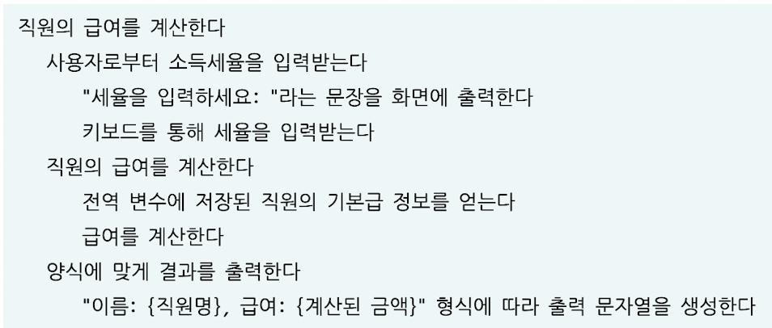
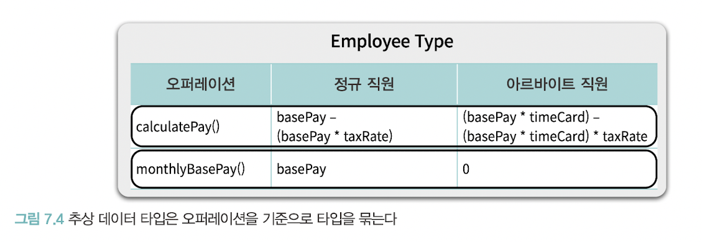
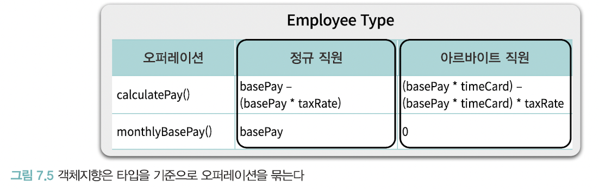
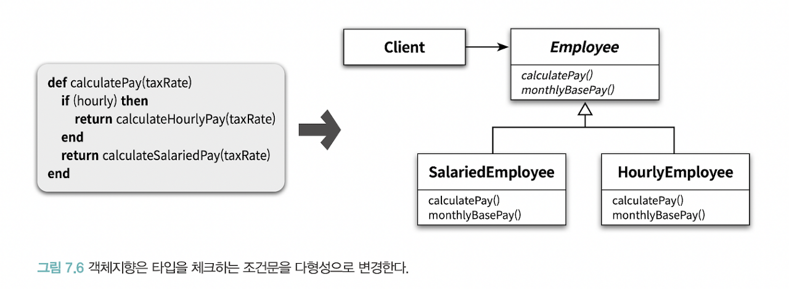

# 7장. 객체 분해

**추상화**  
불필요한 정보를 제거하고 현재의 문제 해결에 필요한 핵심만 남기는 작업

**분해**  
큰 문제를 해결 가능한 작은 문제로 나누는 작업 (한 번에 다뤄야 하는 작업의 크기 줄이기)

# 🔷 1. 프로시저 추상화와 데이터 추상화
### 프로시저 추상화
- 소프트웨어가 무엇을 해야 하는지 추상화
- 기능 분해 / 알고리즘 분해

### 데이터 추상화
- 소프트웨어가 무엇을 알아야 하는지 추상화
- 추상 데이터 타입: 데이터를 중심으로 타입을 추상화
- 객체지향: 데이터를 중심으로 프로시저를 추상화

&nbsp;

# 🔷 프로시저 추상화와 기능 분해
### 메인 함수로서의 시스템
- 알고리즘 분해(기능 분해): 기능은 시스템을 분해하기 위한 기준 -> 프로시저 단위로 분해
- 프로시저: 반복적으로 실행되거나 거의 유사하게 실행되는 작업들을 하나의 장소에 모아놓음으로써 로직을 재사용하고 중복을 방지할 수 있는 추상화 방법
- 내부의 상세한 구현 내용을 모르더라도 인터페이스만 알면 프로시저 사용 가능

### 하향식 접근법 예시

 
기능 분해를 위한 하향식 접근법은 먼저 필요한 기능을 생각하고, 이 기능을 분해하고 정제하는 과정에서 필요한 데이터의 종류와 저장 방식을 식별한다.

 
이는 유지보수에 다양한 문제를 야기한다

### 하향식 기능 분해의 문제점
- **시스템은 하나의 메인 함수로 구성되어 있지 않다**
  - 대부분의 시스템에서 하나의 메인 기능이란 개념은 존재하지 않는다
  - 기능성의 측면에서는 동등하게 독립적이고 완결된 하나의 기능을 표현한다
- **기능 추가나 요구사항 변경으로 인해 메인 함수를 빈번하게 수정해야 한다**
  - 새로운 함수가 추가될 때마다 기존 로직과는 아무런 상관이 없는 해당 함수의 적절한 위치를 확보해야 함
  - 기존 코드를 수정하는 것은 항상 새로운 버그를 만들어낼 확률을 높인다
- **비즈니스 로직이 사용자 인터페이스와 강하게 결합된다**
  - 사용자 인터페이스: 시스템 내에서 가장 자주 변경되는 부분
  - 비즈니스 로직: 사용자 인터페이스에 비해 변경이 적게 발생
  - 구성 요소들의 변경 빈도가 다르기 때문에 근본적으로 변경에 불안정한 아키텍처를 낳는다
- **하향식 분해는 너무 이른 시기에 함수들의 실행 순서를 고정시키기 때문에 유연성과 재사용성이 저하된다**
  - 실행 순서나 조건, 반복과 같은 제어 구조를 미리 결정하지 않고는 분해를 진행할 수 없다: 중앙집중 제어 스타일의 형태
  - 문제는 함수의 제어 구조가 빈번한 변경의 대상이라는 것
  - 시간 순서가 아닌, 논리적 제약을 설계의 기준으로 삼아야 함
- **분해한 함수들을 재사용하기 어렵다**
  - 함수가 재사용 가능하려면, 상위 함수보다 더 일반적이어야 한다
  - 하향식 접근법을 따를 경우, 분해된 하위 함수는 항상 상위 함수보다 문맥에 종속적
- **데이터 형식이 변경될 경우 파급효과를 예측할 수 없다**
  - 어떤 데이터를 어떤 함수가 사용하고 있는지 추적하기 어렵다
  - 데이터 변경으로 인해 어떤 함수가 영향을 받을지 예상하기 어렵다
  - (해결)데이터와 함께 변경되는 부분과 그렇지 않은 부분을 명확히 분리해야 한다
  - (해결)데이터와 함께 변경되는 부분을 하나의 구현 단위로 묶고, 외부에서는 제공되는 함수만 이용해 데이터에 접근해야 한다: 잘 정의된 퍼블릭 인터페이스의 중요성

### 하향식 분해가 유용한 경우
- 이미 해결된 알고리즘을 문서화하고 서술할 때

# 🔷 3. 모듈
### 정보 은닉과 모듈
**정보 은닉**
- 시스템을 모듈 단위로 분리하기 위한 기본 원리
- 시스템에서 자주 변경되는 부분을 상대적으로 덜 변경되는 안정적인 인터페이스 뒤로 감춰야 한다

 
기능 분해가 기능 도출 과정이라면, 모듈 분해는 감춰야 할 비밀을 선택하고 비밀 주변에 안정적인 보호막을 설치하는 보존의 과정

**모듈이 감춰야 하는 비밀**
- 복잡성
  - 모듈이 너무 복잡하면 이해하고 사용하기 어렵다
  - 외부에 모듈을 추상화할 수 있는 간단한 인터페이스를 제공하여 모듈의 복잡도를 낮춘다
- 변경 가능성
  - 변경 가능한 설계 결정이 외부에 노출될 경우, 실제로 변경이 발생했을 때 파급효과가 커진다
  - 변경 발생 시 하나의 모듈만 수정하면 되도록, 변경 가능한 설계 결정을 모듈 내부로 감추고 외부에는 쉽게 변경되지 않을 인터페이스를 제공한다

 
일반적으로 가장 큰 비밀은 데이터이지만, 복잡한 로직이나 변경 가능성이 큰 자료구조도 비밀이 될 수 있다

### 모듈의 장점
- **모듈 내부의 변수가 변경되더라도 모듈 내부에만 영향을 미친다**
  - 어떤 데이터가 변경되었을 때, 영향을 받는 함수를 찾기 위해 프로그램 뒤질 필요가 없다
- **비즈니스 로직과 사용자 인터페이스에 대한 관심사를 분리한다**
  - GUI 같은 다른 사용자 인터페이스를 추가하더라도 모듈에 포함된 비즈니스 로직은 변경되지 않는다
- **전역 변수와 전역 함수를 제거함으로써 네임스페이스 오염을 방지한다**
  - 변수와 함수를 모듈 내부에 포함시키기 때문에 다른 모듈에서도 동일한 이름을 찾을 수 있게 된다
  - 모듈은 전역 네임스페이스의 오염을 방지시키는 동시에 이름 충돌의 위험을 완화한다

- 모듈은 기능이 아니라 변경의 정도에 따라 시스템을 분해하게 한다
- **높은 응집도**: 각 모듈은 외부에 감춰야 하는 비밀과 관련성 높은 데이터와 함수의 집합이다
- **낮은 결합도**: 모듈과 모듈 사이에는 퍼블릭 인터페이스를 통해서만 통신해야 한다

### 모듈의 단점
- 인스턴스의 개념을 제공하지 않는다
- 높은 수준의 추상화를 위해선 모듈이 개별 객체를 독립적인 단위로 다룰 수 있도록 해야 한다
=> 추상 데이터 타입을 사용하자!

# 🔷 4. 데이터 추상화와 추상 데이터 타입
### 추상 데이터 타입
- 타입: 변수에 저장할 수 있는 내용물의 종류와 변수에 적용될 수 있는 연산의 가짓수
- 저장된 값에 대해 수행될 수 있는 연산의 집합을 결정
- 변수의 값이 어떻게 행동할 것이라는 것을 예측할 수 있게 한다
- ex) 정수 타입의 변수: 덧셈 연산 가능 / 문자열 타입의 변수: 연결 연산 가능

### 추상 데이터 타입을 구현하기 위한 프로그래밍 언어의 지원
- 타입 정의를 선언할 수 있어야 한다
- 타입의 인스턴스를 다루기 위해 사용할 수 있는 오퍼레이션의 집합을 정의할 수 있어야 한다
- 제공된 오퍼레이션을 통해서만 조작할 수 있도록 데이터를 외부로부터 보호할 수 있어야 한다
- 타입에 대해 여러 개의 인스턴스를 생성할 수 있어야 한다

 
- 추상 데이터 타입은 구조체와 비슷: 사용자 정의 타입 추가 가능
- 추상 데이터 타입 정의를 기반으로 객체를 생성하는 것은 가능하지만 여전히 데이터와 기능을 분리해서 바라본다: 여전히 데이터와 기능을 분리하는 절차적인 설계의 틀에 갇혀있음

# 🔷 5. 클래스
### 클래스는 추상 데이터 타입인가?
**공통점**
- 데이터 추상화를 기반으로 시스템 분해
- 외부에서는 객체의 내부 속성에 직접 접근 불가능
- 오직 퍼블릭 인터페이스를 통해서만 외부와 의사소통 가능

&nbsp;

**차이점**
- 클래스: 상속과 다형성 지원 (객체지향 프로그래밍)
- 추상 데이터 타입: 상속과 다형성 지원하지 않음 (객체기반 프로그래밍/타입 추상화)

### 타입 추상화와 절차 추상화
**타입 추상화**
> 오퍼레이션을 기준으로 타입을 통합하는 데이터 추상화 기법
- 물리적으로 하나의 타입처럼 보이는 employee 타입 내에 개념 2개 공존
- 하나의 대표적인 타입이 다수의 세부적인 타입을 감추고 있음
- 개별 오퍼레이션이 모든 개념적인 타입에 대한 구현을 포괄하도록 함으로써 하나의 물리적인 타입 안에 전체 타입을 감춘다

 

**절차 추상화**
> 타입을 기준으로 오퍼레이션을 묶는 데이터 추상화 기법
- 정규직원과 아르바이트 직원이라는 두 개의 타입을 명시적으로 정의
- 두 직원 유형과 관련된 오퍼레이션의 실행 절차를 두 타입에 분배
- 공통 로직은 부모 클래스에 위치
- 내부 수행 절차는 다르지만, 클래스를 이용한 다형성은 절차에 대한 차이점을 감춘다

### 변경을 기준으로 선택하라
- 단순히 클래스를 구현 단위로 사용한다는 것이 객체지향 프로그래밍을 한다는 것을 의미하지는 않는다. 
- 타입을 기준으로 절차를 추상화하지 않았다면 그것은 객체지향 분해가 아니다
- 비록 클래스를 사용하고 있더라도 말이다

#### 🔻 내부 인스턴스 변수 기반으로 메서드 내에서 타입을 명시적으로 구분하는 방식은 객체지향 위반이다
- 객체지향에서는 타입 변수를 이용한 조건문을 다형성으로 대체한다
- 클라이언트가 객체의 타입을 확인한 후 적절한 메서드를 호출하는 것이 아니라, 객체가 메시지를 처리할 적절한 메서드를 선택한다
- 객체지향 ~= 조건문을 제거하는 것

=> 개방-폐쇄 원칙: 기존 코드에 아무런 영향도 미치지 않고 새로운 객체 유형과 행위를 추가할 수 있는 객체지향의 특성

### 추상 데이터 타입 vs 객체지향 설계
- 새로운 타입을 빈번하게 추가해야 하는 경우: 객체지향
- 새로운 오퍼레이션을 빈번하게 추가해야 하는 경우: 추상 데이터 타입
- 변경의 축을 찾아라. 객체지향적인 접근법이 모든 경우에 올바른 해결인 것은 아니다