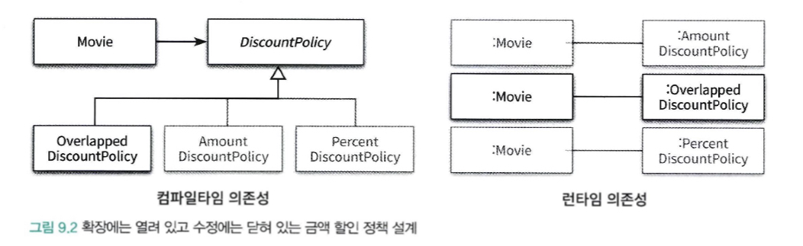
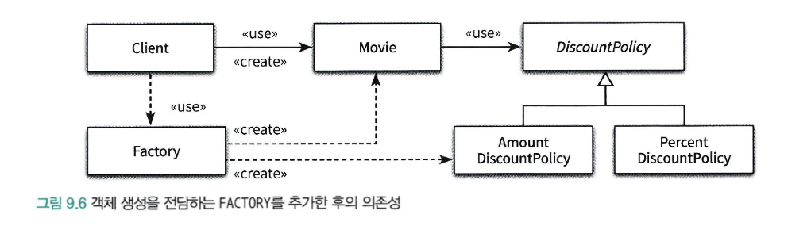
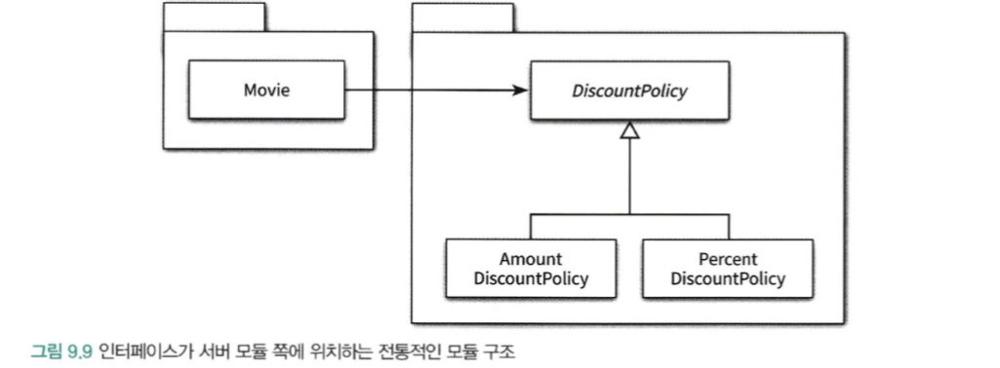
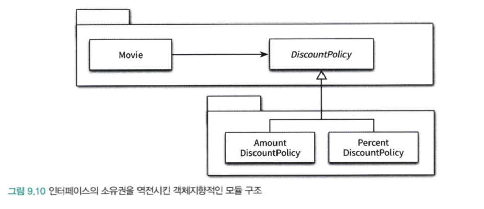

# 9장. 유연한 설계
## 🔷 1. 개방-폐쇄 원칙
**개방폐쇄의 원칙(OCP, Open-Closed Principle)**
소프트웨어 개채(클래스, 모듈, 함수 등등)는 확장에 대해 열려 있어야 하고, 수정에 대해서는 닫혀 있어야 한다.

- 확장에 대해 열려있다: 애플리케이션의 요구사항이 변경될 때 이 변경에 맞게 새로운 동작을 추가해서 애플리케이션의 기능을 확장할 수 있다.
- 수정에 대해 닫혀있다: 기존의 코드를 수정하지 않고도 애플리케이션의 동작을 추가하거나 변경할 수 있다.

&nbsp;

### 🔻 컴파일 타임 의존성을 고정시키고 런타임 의존성을 변경하라
- 런타임 의존성: 실행 시에 협력에 참여하는 객체들 사이의 관계다.
- 컴파일타임 의존성: 코드에서 드러나는 클래스들 사이의 관계다.


&nbsp;

### 🔻 추상화가 핵심이다
개방-폐쇄 원칙의 핵심은 추상화에 의존하는 것이다.

- 추상화: 핵심적인 부분만 남기고 불필요한 부분은 생략함으로써 복잡성을 극복하는 기법
- 추상화 과정을 거치면 문맥이 바뀌더라도 변하지 않는 부분만 남게 되고 문맥에 따라 변하는 부분은 생략된다.
- 추상화를 사용하면 생략된 부분을 문맥에 적합한 내용으로 채워넣음으로써 각 문맥에 적합하게 기능을 구체화하고 확장할 수 있다.

- 추상화 부분은 수정에 닫혀 있다. (공통적인 부분은 변하지 않는다)
- 추상화를 통해 생략된 부분은 확장의 여지를 남긴다. 

**수정에 대한 영향을 최소화하기 위해서는 모든 요소가 추상화에 의존해야 한다**
```java
public class Movie {
  private DiscountPolicy discountPolicy;
  public Movie(String title, Duration runningTime, Money fee, DiscountPolicy discountPolicy) {
    this.discountPolicy = discountPolicy;
  }
  
  public Money calculateMovieFee(Screening screening) {
    return fee.minus(discountPolicy.calculateDiscountAmount(screening));
  }
}
```
Movie 클래스는 안정적인 DiscountPolicy에 대해서만 의존한다.
따라서 할인정책이 수정되더도 calculateMovieFee 메서드는 수정하지 않고 DiscountPolicy 객체만 변경하면 되기 때문에
수정에 닫혀 있고 확장에 열려 있는 구조가 된다.

&nbsp;

## 🔷 2. 생성 사용 분리
### 🔻 FACTORY 사용하기
결합도가 높아질수록 개방-폐쇄 원칙을 따르는 구조를 설계하기가 어려워진다. 특히 객체 생성에 대한 지식은 과도한 결합도를 초래하는 경향이 있다.

객체의 타입과 생성자에 전달해야 하는 인자에 대한 과도한 지식은 코드를 특정한 컨텍스트에 강하게 결합시킨다.
컨텍스트를 바꾸기 위한 유일한 방법은 코드 안에 명시돼 있는 컨텍스트에 대한 정보를 직접 수정하는 것 뿐이다.

```java
public class Movie {
  private DiscountPolicy discountPolicy;
  
  //  AmountDiscountPolicy 를 PercentDiscountPolicy 로 변경하는 방법은 직접 코드를 수정하는 방법 뿐
  public Movie(String title, Duration runningTime, Money fee) {
    this.discountPolicy = new AmountDiscountPolicy();
  }
  
  public Money calculateMovieFee(Screening screening) {
    return fee.minus(discountPolicy.calculateDiscountAmount(screening));
  }
}
```

**객체에 대한 생성과 사용을 분리**
- 객체를 생성할 책임을 클라이언트에게로 옮기기: 현재 컨텍스트에 관한 결정권을 가지고 있는 클라이언트로 컨텍스트에 대한 지식을 옮김으로써 객체는 특정한 클라이언트에 결합되지 않고 독립적일 수 있다
- Factory 추가하기: 객체 생성에 특화된 FACTORY 객체를 추가

```java
public class Factory {
  public Money getAvatarFee() {
    Movie avatar = new Movie("아바타", Duration.ofMinutes(120), Money.wons(10000), new AmountDiscountPolicy());
    return avartar.getFee();
  }
}
```
```java
public class Client {
  
  private Factory factory;
  
  public Client(Factory factory) {
    this.factory = factory;
  }
  
  public Money getAvatarFee() {
    Movie avatar = factory.createAvartarMovie();
    return avartar.getFee();
  }
}
```

Factory에서 생성을 전담하기 때문에 나머지 객체는 사용에 대한 책임만 지고 생성과 관련된 어떤 지식도 가지지 않을 수 있다.



&nbsp;

### 🔻 순수한 가공물에게 책임 할당하기
- 책임 할당의 가장 기본이 되는 원칙은 책임을 수행하는 데 필요한 정보를 가장 많이 알고 있는 INFORMATION EXPERT(도메인)에게 책임을 할당하는 것이다.
- FACTORY의 경우 순수하게 기술적 결정을 위해 생성된 객체: 전체적으로 결합도를 낮추고 재사용성을 높이기 위해 도메인 개념과 아무런 상관이 없는 가공의 객체로 객체 생성 책임을 이동

**표면적 분해 VS 행위적 분해**
1) 표면적 분해
- 도메인에 존재하는 사물 또는 개념을 표현하는 객체들을 이용해 시스템을 분해하는 것
- 도메인 모델에 담겨 있는 개념과 관계를 따르며 도메인과 소프트웨어 사이의 표현적 차이를 최소화하는 것을 목적으로 한다.
- 객체지향 설계를 위한 가장 기본적인 접근법
2) 행위적 분해 
- 도메인 개념을 표현한 객체가 아닌 설계자가 편의를 위해 임의로 만든 객체를 이용해 시스템을 분해하는 것
- 도메인 개념을 표현하는 객체에게 책임을 할당하는 것만으로는 부족한 경우 발생
- 데이터베이스 접근을 위한 객체와 같이 도메인 개념들을 초월하는 기계적인 개념이 필요한 경우도 있다. (DAO와 같은.)
- 책임을 할당하기 위해 창조죄는 도메인과 무관한 인공적인 객체를 PURE FABRICATION(순수한 가공물)이라 한다.
- 어떤 행동을 추가하려고 하는데 이 행동을 책임질 마땅한 도메인 개념이 존재 하지 않는 경우 PURE FABRICATION을 생성하고 이 객체에게 책임을 할당하면 된다.
- 객체지향 어플리케이션에서는 도메인 개념을 반영하는 객체들 보다 인공적으로 창조한 객체들이 더 많은 비중을 차지한다.

&nbsp;

## 🔷 3. 의존성 주입
사용하는 객체가 아닌 외부의 독립적인 객체가 인스턴스를 생성한 후 이를 전달해서 의존성을 해결하는 방법

의존성을 해결하기 위해 의존성을 객체의 퍼블릭 인터페이스에 명시적으로 드러내서 외부에서 필요한 런타임 의존성을 전달할 수 있도록 만드는 방법을 포괄

**1) 생성자 주입 (Constructor Injection)**
객체를 생성하는 시점에 생성자를 통한 의존성 주입
```java
Movie avartar = new Movie("아바타", Duration.ofMinutes(120), Money.wons(10000), new AmountDiscountPolicy());
```

**2) setter 주입 (Setter Injection)**
setter 주입은 이미 생성된 객체에 대해 setter 메서드를 통해 의존성을 해결한다.
```java
Movie avartar = new Movie("아바타", Duration.ofMinutes(120), Money.wons(10000));
avartar.setDiscountPolicy(new AmountDiscountPolicy());
```
- setter 주입의 단점은 객체가 올바로 생성되기 위해 어떤 의존성이 필수적인지를 명시적으로 표현할 수 없다는 것이다.
- setter 메서드는 객체가 생성된 후에 호출돼야 하기 때문에 setter 메서드 호출을 누락한다면 객체는 비정상적인 상태로 생성될 것이다.

**3) 메서드 주입 (Method Injection)**
- 메서드 주입은 메서드 호출 주입 (method call injection)이라고도 부르며 메서드가 의존성을 필요로 하는 유일한 경우일 때 사용할 수 있다.
- 생성자 주입을 통해 의존성을 전달받으면 객체가 올바른 상태로 생성되는 데 필요한 의존성을 명확하게 표현할 수 있다
- 주입된 의존성이 1~2개의 메서드에서만 사용된다면 각 메서드의 인자로 전달하는 것이 더 나은 방법일 수 있다.
```java
Movie avartar = new Movie("아바타", Duration.ofMinutes(120), Money.wons(10000));
avartar.calculateDiscountAmount(screnning, new AmountDiscountPolicy());
```

### 🔻 숨겨진 의존성은 나쁘다
**SERVICE LOCATOR 패턴**
- 의존성 주입 외에도 의존성을 해결할 수 있는 방법이 존재
- SERVICE LOCATOR: 의존성을 해결할 객체들을 보관하는 일종의 저장소다.
- 외부에서 객체에게 의존성을 전달하는 의존성 주입과 달리 SERVICE LOCATOR의 경우 객체가 직접 SERVICE LOCATOR에게 의존성을 해결해줄 것을 요청한다.

```java
public class Movie {
  private DiscountPolicy discountPolicy;
  
  public Movie(String title, Duration runningTime, Money fee) {
    this.title = title;
    this.runningTime = runningTime;
    this.fee = fee;
    this.dicountPolicy = ServiceLocator.discountPolicy();
  }
}
```
```java
public class ServiceLocator {
  private static ServiceLocator singleton = new ServiceLocator();
  
  public static DiscountPolicy discountPolicy() {
    return singleton.discountPolicy();
  }
  
  public static void provide(DicountPolicy discountPolicy) {
    singleton.discountPolicy = discountPolicy;
  }
}
```

**단점**
의존성을 구현 내부로 감춘다
   의존성과 관련된 문제가 컴파일 타임이 아닌 런타임에 가서야 발견된다는 사실을 알 수 있다. (문제점을 발견할 수 있는 시점을 코드 작성 시점이 아니라 실행 시점으로 미루기 때문이다)
- 내부적으로 정적 변수를 이용해 객체들을 관리하기 때문에 모든 단위 테스트 케이스에 걸쳐 ServiceLocator의 상태를 공유하게 된다: 각 단위 테스트는 서로 고립돼야 한다는 단위 테스트의 기본 원칙을 위반
- 캡슐화 위반: 의존성을 이해하기 위해 코드나 내부 구현을 이해할 것을 강요

**따라서 의존성 주입을 사용하여 외부 인터페이스에 의존성을 노출 시키는 것이 가장 깔끔하다**

&nbsp;

## 🔷 4. 의존성 역전 원칙
### 🔻 추상화와 의존성 역전
**유연하고 재사용 가능한 설계를 원한다면 모든 의존성의 방향이 추상 클래스나 인터페이스와 같은 추상화를 따라야 한다.**

**의존성 역전 법칙 Dependency Inversion Principle**
- 상위 수준의 모듈은 하위 수준의 모듈에 의존해서는 안 된다. 둘 모두 추상화에 의존해야 한다.
- 추상화는 구체적인 사항에 의존해서는 안 된다. 구체적인 사항은 추상화에 의존해야 한다.

&nbsp;

### 🔻 의존성 역전 원칙과 패키지
역전은 의존성의 방향 뿐만 아니라 인터페이스의 소유권에도 적용된다

1) 전통 구조
- Movie가 DiscountPolicy에 대해 컴파일 타임 의존성을 가진다.
- 이 말은 Movie 클래스를 빌드하기 위해 DiscountPolicy가 같은 패키지 내에 필요함을 의미한다.
- 하지만 DiscountPolicy가 있는 패키지에서는 AmountDiscountPolicy, PercentDiscountPolicy가 있기때문에 전체적인 빌드 타임이 증가한다.


2) 객체지향적인 모듈 구조
**Seperated Interface 패턴**
- 추상화를 별도의 독립적인 패키지가 아니라 클라이언트가 속한 패키지에 포함시켜야 한다.
- 함께 재사용될 필요가 없는 클래스들은 별도의 독립적인 패키지에 모아야 한다.


&nbsp;

## 🔷 5. 유연성에 대한 조언
### 🔻 유연한 설계는 유연성이 필요할 때만 옳다
유연성은 항상 복잡성을 수반하기 때문에 이를 수용할 수 있을 때만 가치가 있다

&nbsp;

### 🔻 협력과 책임이 중요하다
- 설계를 유연하게 만들기 위해서는 먼저 역할, 책임, 협력에 초점을 맞춰야 한다.
- 다양한 컨텍스트에서 재사용할 필요가 없다면 설계를 유연하게 만들 당위성도 함께 사라진다.
- 객체를 생성하는 방법에 대한 결정은 모든 책임이 자리를 잡은 후 가장 마지막 시점에 내리는 것이 적절하다.